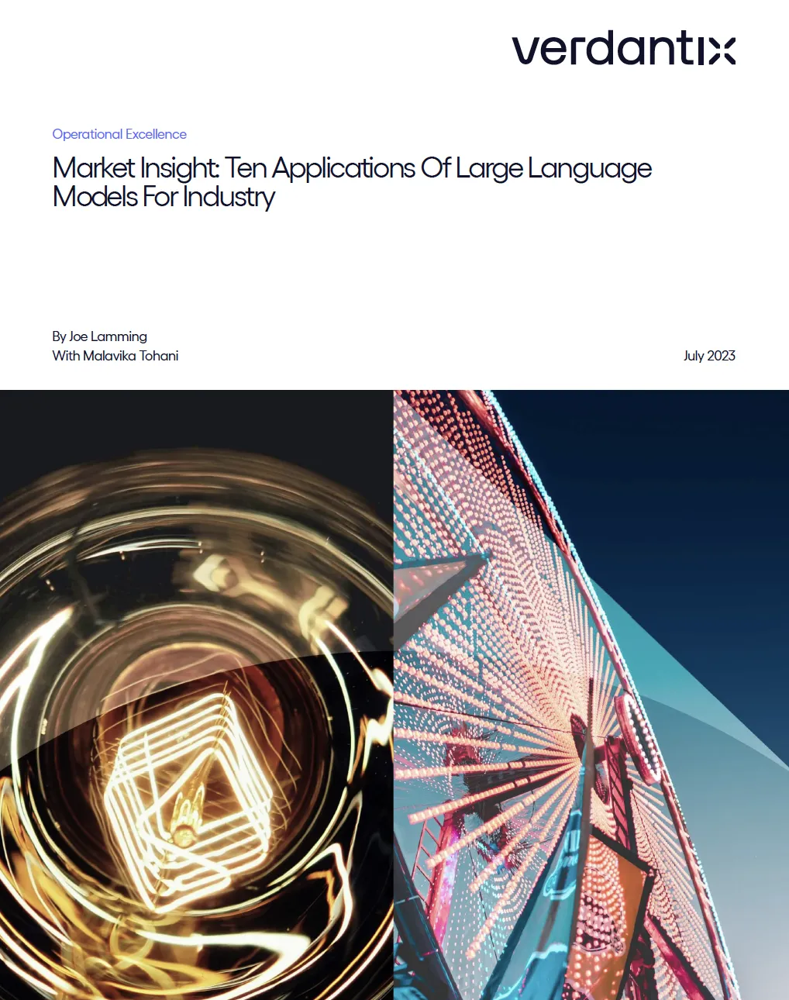
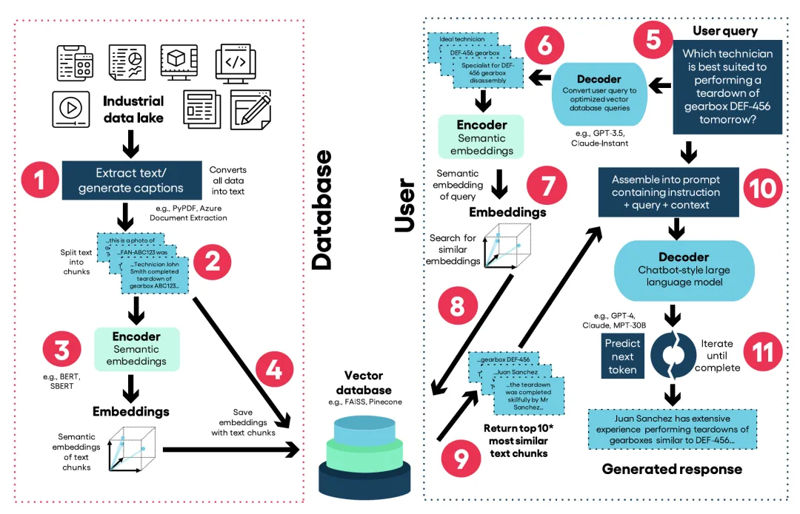
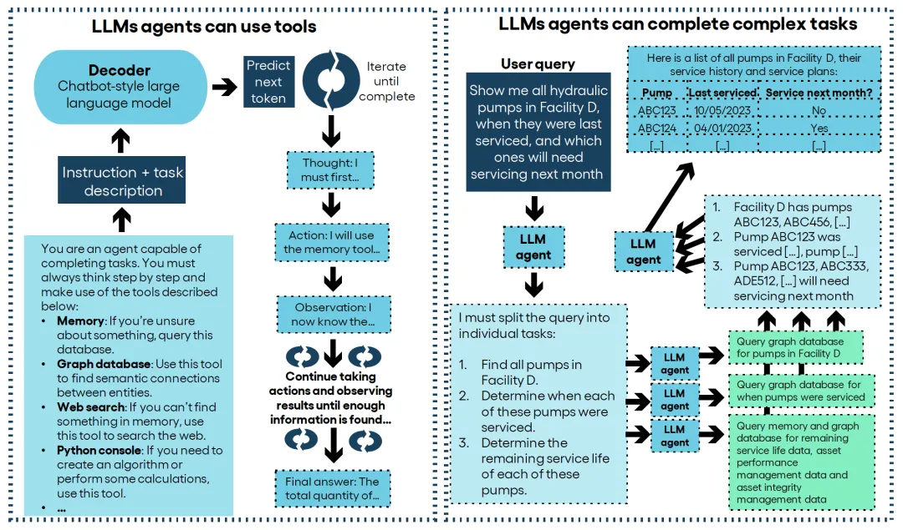
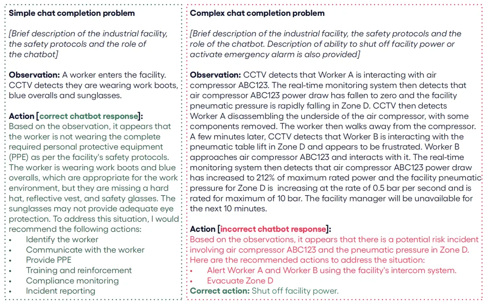

** **

随着时间的推移，LLM（大型语言模型）的特性和能力逐渐为人们所熟知。它们展现了无与伦比的人类语言理解、出色的文本生成能力以及友好的对话指令跟随倾向。而像GPT-4和Claude等更为强大的LLM则展现出了对现实世界因果关系的深刻理解。据报道，GPT-4甚至采用了八个与GPT-3.5规模相当的LLM，通过混合专家（MoE）的方式进行配置。

尽管LLM在某些方面存在限制，如在过多上下文的情况下可能产生事实幻觉，以及在算术方面存在缺陷，但这些问题已通过精心设计的提示、RAG技术和专门的软件包装得到了解决，使LLM的行为更加接近理想的“代理”模式。OpenAI的首席执行官Sam
Altman将这些进步比作“寒武纪爆炸”，意味着人工智能技术的迅猛发展和广泛应用潜力。

然而，这些技术突破也增加了监管机构采取行动的压力。例如，欧盟在2021年提出了AI法案，旨在规范人工智能的使用，确保其在法律、伦理和社会责任方面的合规性（参见Verdantix的报告《欧盟对人工智能监管发出鸣号》）。与此同时，工业领域的运营、维护和工艺安全主管也面临着巨大的挑战。他们需要优化生产过程、提高产量、减少排放，并满足日益严格的安全标准。

在快速的技术演进、日益严格的监管和社会担忧之间，存在着一定的紧张关系。然而，Verdantix在报告中指出了工业领域生成AI的十个高价值应用案例。这些案例展示了生成AI技术在解决工业领域实际问题方面的巨大潜力，为企业提供了优化生产、提高效率、减少成本并满足安全标准的新途径。

## 01

**从庞大的数据集中提取相关的关键信息，以获得简明扼要的见解**

> Extracting relevant critical information from vast data sets for concise insights.
>

随着数字化在工业企业中的推广，由此产生的数据仓库和数据湖将存储从成千上万台物联网（IoT）设备上数十年的高频传感器测量数据，到数百万份检验报告、工单、扫描笔记和生产日志等各种数据。Salesforce
Research公司的BLIP-2等功能强大的图像标注工具能够利用基于文本的数据丰富可视数据，而C3
AI和Cognite等公司的表格和文档解析工具则为LLM提供了多模态数据的可视性。通过使用检索系统向 LLM
提供文本块，操作员可以获得相关数据的对话式、基于真实情况的表述（见图5）。Cognite 的工业知识图谱为 LLM
提供了资产、流程、技术和人员之间的语义关系，以减少幻觉。基于 LLM 的信息检索系统可为操作员提供简明、相关的大局观见解，帮助他们发现低效和安全风险。

> As digitization is rolled out across industrial enterprises, the resulting data warehouses and data lakes will store
>
> everything from decades of high-frequency sensor measurements across thousands of Internet of Things (IoT)devices, to
> millions of inspection reports, work orders, scanned notes and production logs. Powerful image captioning tools, such
> as
> BLIP-2 by Salesforce Research, enable the enrichment of visual data with text-based metadata, while table and document
> parsing tools by firms such as C3 AI and Cognite offer LLMs visibility into multimodal data. By employing retrieval
> systems to serve text chunks to LLMs, operators are provided with conversational, grounded-in-truth representations of
> relevant data (see Figure 5). Cognite’s Industrial Knowledge Graph provides LLMs with semantic relationships between
> assets, processes, technologies and people, to reduce hallucinations. LLM-based information retrieval systems give
> operators concise, relevant insights for a big-picture view – helping them discover inefficiencies and safety risks.

**
图5
**

## 02

**通过自动化消除重复性行政工作**

> Eliminating repetitive administrative tasks through automation.
>

数字孪生、人工智能分析和资产管理软件等技术有助于实现工业设施多个流程的自动化，在 2022 年 Verdantix 全球企业卓越运营调查中，301
位受访者中有 87% 提到新技术的可用性是推动工厂运营数字化转型的最重要因素。2023 年 4 月，西门子宣布与微软合作，在微软团队（Microsoft
Teams）中推出全新的 Teamcenter 应用程序，帮助车间工人解析和翻译自然语音，生成汇总报告，并将信息传递给相应的设计、工程或制造人员。

> Technologies such as digital twins, AI analytics and asset management software help automate multiple processes at
> industrial facilities, with 87% of the 301 respondents in the 2022 Verdantix global corporate operational excellence
> survey mentioning the availability of new technologies as the most significant factor driving digital transformation
> of
> plant operations (see Verdantix Global Corporate Survey 2022: Operational Excellence Budgets, Priorities & Tech
> Preferences). LLMs will enhance these capabilities even further by performing mundane, repetitive administrative tasks
> such as drafting emails, scanning reports to triage risks and retrieving information from systems where conventional
> software integration has not been implemented.In April 2023 Siemens announced a collaboration with Microsoft to launch
> its new Teamcenter app within Microsoft Teams, helping shop floor workers parse and translate natural speech, generate
> summarized reports and route information to appropriate design, engineering or manufacturing personnel.

## 03

**实现更强大的工业数据采集、转换和上下文关联**

> Enabling more robust industrial data ingest, transformation and contextualization.
>

如果没有合适的工具，工业数据可能非常庞大、难以捉摸且管理成本高昂。AspenTech、AVEVA、HighByte 和 Hitachi Vantara 等公司提供工业
DataOps 平台，以满足各种数据管理需求，而 Timeseer.ai 等其他公司则提供特定工具，以检测 100 多种数据质量问题并发出警报。LLM
（大模型）擅长解析非结构化数据、使用推理添加上下文以及排除软件问题。作为代理部署，生成式人工智能将大大提高数据管理和协调的易用性（见图6）。Cognite
的 Industrial Canvas 平台由基于 LLM （大模型）的代理和生成式人工智能提供支持，在单一视图中实现多模态上下文关联。

> Industrial data can be vast, inscrutable and expensive to manage without suitable tools (see Verdantix Strategic
> Focus:
> Why Industrial Firms Need DataOps Platforms For Asset Management Digitization). Firms such as AspenTech, AVEVA,
> HighByte
> and Hitachi Vantara offer industrial DataOps platforms to meet diverse data management needs, while others, such as
> Timeseer.ai, provide specific tools to detect and provide alerts for more than 100 data quality issues. LLMs excel at
> parsing unstructured data, using reasoning to add context, and troubleshooting software issues. Deployed as agents,
> generative AI will greatly increase the ease of use of data management and orchestration (see Figure 6). Included in
> Cognite’s Industrial Canvas platform is multimodal contextualization within a single pane of glass view, powered by
> LLM-based agents and generative AI.

**
图6
**

## 04

**作为推理引擎，为操作和维护人员快速提供辅助意见**

> Offering ops & maintenance workers a quick second opinion by acting as a reasoning engine.
>

经过 RLHF 调整的 LLM 能够遵从自然语言指令，使它们能够以人类可以理解的方式，通过思维链或思维递归推理来探索数字环境。

通过思维链或思维递归推理，以人类可以理解的方式探索数字环境。它们可以查询工业数据湖、阅读和汇总文档，或通过与企业资产管理（EAM）、环境健康安全（EHS）或资产性能管理（APM）软件的连接查看实时数据。作为代理（根据用户指令执行任务）部署的
LLM 可以承担许多琐碎的知识收集和基本分析工作，简化一线工人的任务，例如获取设备中特定资产（如泵）的列表，记录其服务历史，并预测哪些资产下个月需要维修（见图6）。虽然即使是当今最强大的
LLM（如 GPT-4 和 Claude）有时也会犯错，但如果利用适当的软件支架来引导他们的注意力，他们对世界的一般知识就能为操作员、经理和工程师提供快速、无需判断的理智检查，或对关键决策提供第二意见（见图4）。

> The ability of RLHF-tuned LLMs to follow natural language instructions allows them to explore their digital
>
> environment through chain-of-thought or recursion-of-thought reasoning in a way that is understandable to humans. They
> can query industrial data lakes, read and summarize documents, or review real-time data through connections to
> enterprise asset management (EAM), EHS or asset performance management (APM) software. Deployed as agents – to perform
> a
> task based on user instructions – LLMs can undertake much of the mundane knowledge-gathering and basic analysis,
> streamlining frontline worker tasks such as fetching a list of specific assets (for example, pumps) in a facility,
> noting their service history, and predicting which ones will need servicing next month (see Figure 6). While even
> today’s most powerful LLMs, such as GPT-4 and Claude, will sometimes make mistakes, their general knowledge of the
> world, when utilized with the appropriate software scaffolding to direct their attention, offers operators, managers
> and
> engineers a quick, judgement-free sanity check or second opinion on critical decisions (see Figure 4).

**
图4
**

## 05

**自动对资产维护任务进行分类和优先排序**

> Automatically categorizing and prioritizing asset maintenance tasks.
>

LLM
擅长分析非结构化数据（无论是直接分析、从文件中提取文本分析，还是从人工智能视觉模型生成的标题分析），具有无限的耐心，可以持续监控上传到工业数据池的实时信息。可利用此类功能从数据中提取情感信息，将其与运营优先事项进行比较，并向设备和企业决策者提供相应的摘要。同样，LLM
可以使用风险和关键度量筛选成千上万份检查报告、图像字幕和可用的通话记录，以检测即将发生的事故，并通过代理式流程自动化向现场管理人员及时发出警报。

> Expert at analysing unstructured data – either directly, from text scraped from documents, or from captions generated
> by
> AI vision models – LLMs have limitless patience to continuously monitor real-time information uploaded to industrial
> data lakes. Such functionality can be leveraged to extract sentiment from data, compare it with operational priorities
> and serve summaries to facilities and corporate decision-makers accordingly. Similarly, LLMs can use risk and
> criticality metrics to screen thousands of inspection reports, image captions and available transcripts from calls to
> detect imminent incidents and provide timely alerts through agent-style process automation to site managers.

## 06

**通过语音口述进行检查和维护，实现完全免提操作**

> Facilitating fully hands-free operation with voice dictation for inspections and maintenance.
>

十多年来，智能手机上已经部署了苹果 Siri、谷歌助手等多种形式的听写系统。然而，这些系统在识别特定领域词汇或持续提取复杂指令方面能力有限。2022
年，OpenAI 发布了开源的 Whisper 模型——一种多功能、通用的语音到文本系统，该系统在 68 万小时的文字记录基础上进行了训练。这种模型可以与
LLM 和视觉系统相结合，为虚拟助手提供信息，并为现场操作人员提供免提的音频和视觉信息。虽然 Whisper
和类似模型目前的计算成本较高，但企业从准确转录中获得的价值正在推动创新，并使经过训练可识别特定行业术语的紧凑型模型得以快速发展。此类系统将为一线工人提供基于软件的推理引擎和虚拟助手，帮助他们完成复杂的任务，尤其是在偏远地区。

> For more than a decade, dictation has been deployed on smartphones in the form of Apple’s Siri, Google’s Assistant and
> numerous others. However, such systems have been limited in their ability to recognize domain-specific words or
> consistently extract complex instructions. In 2022 OpenAI released the open-source Whisper model – a versatile,
> general-purpose speech-to-text system trained on 680,000 hours of transcripts. Such models can be combined with LLMs
> and
> vision systems to feed a virtual assistant and provide audio and visual information to operators in the field,
> hands-free. While Whisper and similar models are currently computationally expensive, enterprise-focused value from
> accurate transcription is driving innovations and enabling the rapid development of compact models trained to
> recognize
> industry-specific terminology. Such
>
> systems will offer frontline workers a software-based reasoning engine and virtual assistant to help with complex
> tasks,
> especially in remote locations.

## 07

**利于PLC编程普及化**

> Democratizing asset programmable logic controller (PLC) programming.
>

计算机编程语言需要严密的逻辑，而互联网上围绕软件开发的深入讨论无处不在，这意味着法律硕士们已经学会将代码与自然语言紧密联系在一起。在工业领域，ABB、罗克韦尔自动化公司（Rockwell
Automation）和西门子（Siemens）等机器供应商为其产品编程提供了大量公开文档。微软旗下的 GitHub Copilot 于 2021 年推出，2022
年开始广泛使用，为软件开发人员提供了复杂的自动完成功能，包括根据自然语言描述生成函数的能力。同样，2023 年 5 月，ABB
研究公司发表了一篇论文，详细介绍了OpenAI 的 ChatGPT/GPT-4 使用自然语言描述 PLC/DCS 功能，生成语法正确的 IEC 61131-3
结构化文本代码，并展示有用的推理技能，以提高控制工程师的工作效率，同时提供控制叙述。

> The rigorous logic required by computer programming languages, alongside the ubiquity of thorough discourse around
> software development on the internet, means that LLMs have learned to closely associate code with natural language. In
> the industrial space, machine vendors such as ABB,Rockwell Automation and Siemens offer extensive public documentation
> for programming their products. Microsoft-owned GitHub Copilot, launched in 2021 and widely available from 2022,
> offers
> sophisticated auto-complete features to software developers, including the ability to generate a function based on a
> natural language description. Similarly, in May 2023 ABB Research published a paper detailing how
>
> OpenAI’s ChatGPT/GPT-4 uses natural language description of PLC/DCS functionality to generate syntactically correct
> IEC
> 61131-3 Structured Text code and demonstrate useful reasoning skills to boost control engineer productivity, alongside
> control narratives.

## 08

**为全员提供低代码、自然的对话式界面**

> Delivering a low-code, natural, conversational interface to the whole workforce.
>

LLM
在全球人类语言与工业数据库和软件解决方案中使用的大量代码或领域语言之间提供了一个通用翻译层。如今，许多工业软件解决方案都依赖于精心设计的图形用户界面 (
GUI)、特定应用布局和广泛的用户培训计划，以帮助客户从中获得最大价值。然而，在现场解决问题可能需要使用不同的工具和软件解决方案——图形用户界面限制太多，竞争厂商之间的互操作性有限。LLM
能够通过 Python 等通用编程语言利用代码级接口，使用户能够利用平台的强大细粒度功能。2023 年 6 月，Hexagon 推出了 HxGN EAM
Python 框架，而 C3 AI 则通过其适用于各种编程语言的类型系统提供代码级功能。同样在 6 月，Cognite 推出了 Copilot 产品，利用 LLM
的自然交流能力，将其作为通用的低代码接口，连接到其解决方案的最先进功能，从而为更多的一线工人、数据科学家、设施管理人员和高管提供了通过他们喜欢的媒介与关键信息进行交互的能力。

> LLMs offer a universal translation layer between global human languages and the code-heavy or domain language used
> across industrial databases and software solutions. Today, many industrial software solutions rely upon carefully
> designed graphical user interfaces (GUIs), application-specific layouts and extensive user training programmes to help
> customers get the most value out of them. However, problem-solving in the field can require the use of disparate tools
> and software solutions – where GUIs are too restrictive and interoperability between competing vendors is limited. The
> ability of LLMs to utilize code-level interfaces through common programming languages such as Python allows users to
> leverage the powerful granular functionality of a platform. In June 2023 Hexagon launched its HxGN EAM Python
> Framework,
> while C3 AI offers code-level functionality through its Type System for a variety of programming languages. Also in
> June, Cognite launched its Copilot product to utilize the natural communication abilities of LLMs to act as a
> general-purpose low-code interface to its solution’s most advanced features – thereby providing far more frontline
> workers, data scientists, facilities managers and executives with the ability to interact with critical information
> through their preferred medium.

## 09

**开发更先进的人工智能视觉系统，以优化生产质量**

> Developing more advanced AI-based vision systems for production quality optimization.
>

在 2020 年之前，计算机视觉和 LLM 是截然不同的技术，当时的视觉转换器（ViT）模型部署了为语言设计的架构，以分析一系列图像补丁，从而更好地理解视觉数据。2021
年，OpenAI 的 CLIP 模型利用 ViT 识别复杂的视觉特征；2023 年 6 月，Salesforce Research 的 BLIP-2 部署了基于 CLIP 的 ViT 与
LLM，实现了与图像的对话交互。通过对视觉模型和 LLM
进行微调以提供特定领域的见解，生产线上的质量管理将提高准确性，领域专家的技能也将得到更好的利用。其他基于视觉的模型可以帮助填补缺失的数据。2023
年 5 月，SparkCognition 宣布与壳牌石油公司合作，部署基于图像的生成式人工智能，将进行地震勘测所需的时间从 9 个月缩短到 9 天。

> Computer vision and LLMs were distinctly different technologies up until 2020, when the vision transformer (ViT) model
> deployed the architecture designed for language to analyse a sequence of image patches, to better understand visual
> data. In 2021 OpenAI’s CLIP model utilized the ViT to recognize complex visual features, while in June 2023 Salesforce
> Research’s BLIP-2 deployed a CLIP-based ViT combined with an LLM to allow conversational interaction with images. By
> fine-tuning vision models and LLMs to provide domain-specific insights, quality management on production lines will
> see
> improved accuracy and domain expert skills will be better utilized. Other vision-based models can help fill in missing
> data. In May 2023 SparkCognition announced a collaboration with Shell to deploy image-based generative AI to shorten
> the
> time required to conduct seismic surveys from nine months to just nine days.

## 10

**为培训提供丰富可视的 3D 虚拟环境**

> Providing richly visual 3D virtual environments for training.
>

潜在扩散模型，如 OpenAI 的 DALLE-2 和 Stability AI 的 Stable Diffusion，可根据稀疏的自然语言提示生成令人信服的逼真环境。利用稳定扩散衍生模型的开源项目（如
ControlNet）可对图像生成进行精细控制，包括用特定领域的场景来丰富虚拟环境。另一个项目是英伟达™（NVIDIA®）的NeuralField-LDM，它使用分层潜在扩散模型生成逼真、复杂的三维场景。这些技术将为一线工人提供前所未有的身临其境的培训环境，有助于知识转移和降低操作风险。

> Latent diffusion models, such as OpenAI’s DALLE-2 and Stability AI’s Stable Diffusion, generate convincingly realistic
> surroundings based on sparse natural language prompts. Open-source projects utilizing derivations of Stable Diffusion,
> such as ControlNet, offer fine controls over the generation of images – including the ability to enrich virtual
> environments with domain-specific scenery. Another project, NVIDIA’s NeuralField-LDM, uses hierarchical latent
> diffusion
> models to generate realistic, complex 3D scenes. Such technologies will give frontline workers unprecedented access to
> immersive training environments, helping with knowledge transfer and reducing operational risk.