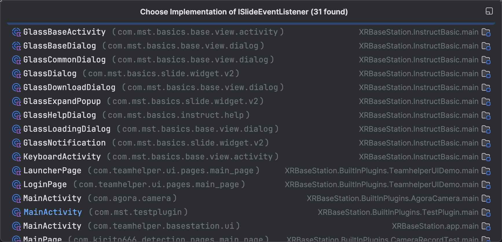

`Glass Application SDK`在所有实现了`ISlideEventListener`接口的基类中提供了`slideEventViewManager.setCheckViewListener(view)`方法，用于设置用户当前的操作焦点，后设置的覆盖先设置的，在实践中我们通过此方法设置用户进入到当前页面的默认操作焦点。


<p align="center"></p>

## Kotlin扩展函数

我们在`GlassBaseActivity`等基类中中提供了面向Kotlin开发者的`.focus()`扩展函数以及面向Java开发者的`.setFocusView(view)`函数，当然你也可以通过最原始的`.slideEventViewManager.setCheckViewListener(view)`来设置操作焦点。

:::: code-group
::: code-group-item GlassBaseActivity.kt

```kotlin
fun ISlideEventViewListener.focus() {
    setFocusView(this)
}

fun setFocusView(view: ISlideEventViewListener) {
    slideEventViewManager.setCheckViewListener(view)
}
```

:::

::::

以下三种写法等价

```kotlin
v.btnConfirm.focus()
```

```java
setFocusView(v.btnConfirm);
```

```kotlin
slideEventViewManager.setCheckViewListener(v.btnConfirm)
```

