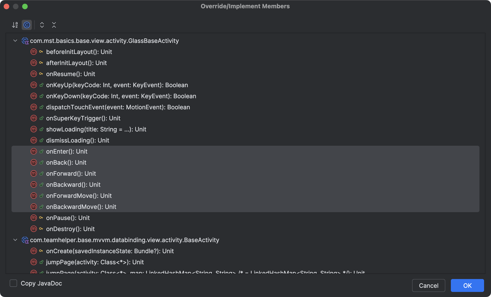

## 设置View对手势操作的响应

`Glass Application SDK` 封装的组件预留了`setSlideEventViewStateListener`接口以实现组件View实例对用户手势操作行为的响应。具体使用示例如下：

```kotlin
v.btnConfirm.setSlideEventViewStateListener(object : ISlideEventViewStateListener() {
    override fun onEnter(view: View) {
        super.onEnter(view)
    }

    override fun onBack(view: View) {
        super.onBack(view)
    }

    override fun onChecked(view: View) {
        super.onChecked(view)
    }

    override fun onUncheck(view: View) {
        super.onUncheck(view)
    }

    override fun onJoinNextLevel(view: View) {
        super.onJoinNextLevel(view)
    }
})
```

## 手势操作回调

`Glass Application SDK` 提供的封装`View`和`Activity`基类均已实现了`ISlideEventListener`接口，当开发者需要在`Activity`中监听AR设备操作或需要在`自定义View`中监听AR设备操作，可以通过重写`ISlideEventListener`中定义的方法，用以实现监听用户对AR眼镜的交互。

<p align="center"></p>

```kotlin
class MainActivity : GlassBaseActivity<ActivityMainBinding, EmptyViewModel>() {

	...

    /**
     * 确定事件 如果当前的滑块模式为FORWARD_OR_BACKWARD 则触发滑块管理的确定方法
     */
    override fun onEnter() {
        super.onEnter()
    }

    /**
     * 返回事件 如果当前的滑块模式为FORWARD_OR_BACKWARD 则触发滑块管理的返回方法
     */
    override fun onBack() {
        super.onBack()
    }

    /**
     * 前滑事件 如果当前的滑块模式为FORWARD_OR_BACKWARD 则触发滑块管理的前滑方法
     */
    override fun onForward() {
        super.onForward()
    }

    /**
     * 后滑事件 如果当前的滑块模式为FORWARD_OR_BACKWARD 则触发滑块管理的后滑方法
     */
    override fun onBackward() {
        super.onBackward()
    }

    /**
     * 前滑移动
     */
    override fun onForwardMove() {
        super.onForwardMove()
    }

    /**
     * 后滑移动
     */
    override fun onBackwardMove() {
        super.onBackwardMove()
    }
	...
}
```

## `ISlideEventListener`接口定义

```java
package com.mst.basics.slide.listener;

public interface ISlideEventListener {

    /**
     * 单指长按
     */
    void onSuperKeyTrigger();

    /**
     * 单击
     */
    void onEnter();

    /**
     * 后退
     */
    void onBack();

    /**
     * 前滑
     */
    void onForward();

    /**
     * 后滑
     */
    void onBackward();

    /**
     * 前滑移动
     */
    void onForwardMove();

    /**
     * 后滑移动
     */
    void onBackwardMove();
}

```
