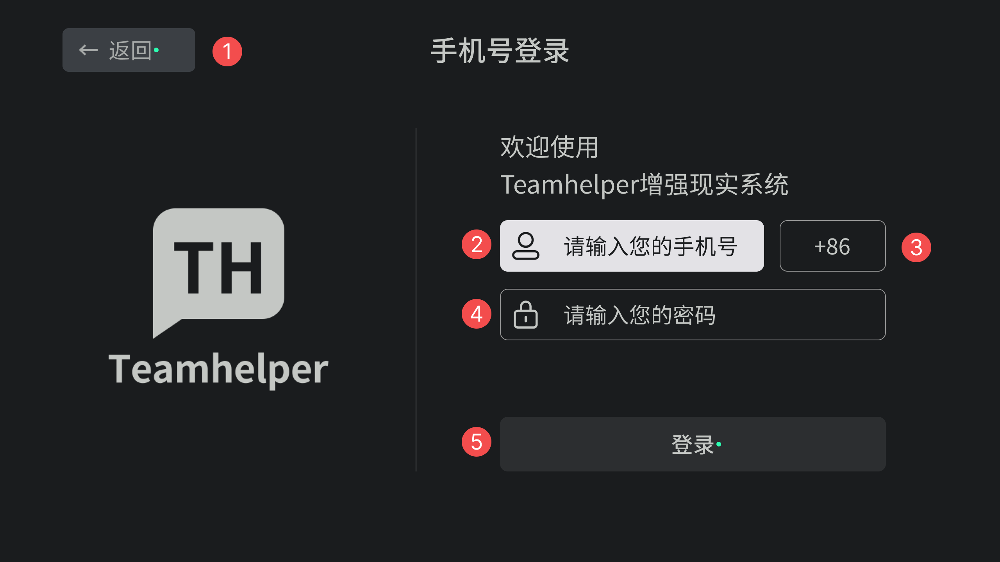

`Glass Application SDK` 中将用户在页面上操作的View规划为一层级，并需要开发者以从左到右、从上而下的顺序主动设置操作标识`sign`，编制完毕后用户将可以使用物理操作按钮进行顺序操作，如以下示例页面。

<p align="center"></p>

## 在布局中设置标记

```xml
<com.mst.basics.slide.widget.v2.GlassButton
    ...
    app:sign="1"
    ... />
```

## 在代码中设置标记

`Glass Application SDK` 中的操作标记`sign`实际上是使用了`contentDescription`属性用来记录，所以在代码中你也可以直接通过`View.setContentDescription`来主动设置标记，这一点在给`RecyclerView`的`item`编制操作顺序时非常有用。关于如何在`RecyclerView`设置操作标识将在UI组件章节[列表组件](ui_components_list)中详细阐述。

```kotlin
v.btnConfirm.contentDescription = "1"
```
