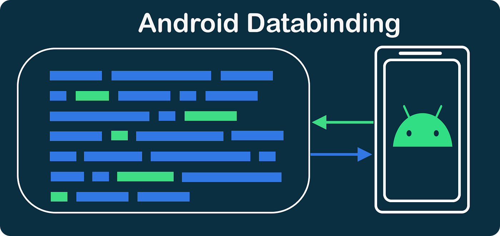
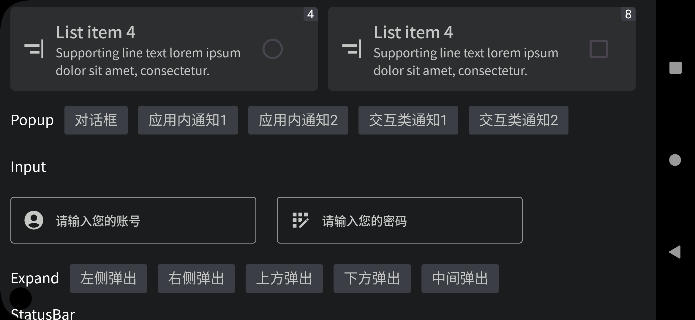

# SDK 框架概览

`Glass Application SDK` 是一款专为 XR 眼镜设计的开发工具包，基于 `MVVM` 架构，提供了丰富的基类和 UI 组件，以及统一的操作交互逻辑，封装了对 XR 眼镜上相机和麦克风的操作，能够大大提升开发效率，降低开发难度。

## 架构

Glass Application SDK 基于 MVVM (Model-View-ViewModel) 架构模式，这种模式允许数据模型、用户界面和行为逻辑分离，提高了代码的可读性和可维护性。

- **Model**：负责管理应用程序的业务逻辑和数据。在 `Glass Application SDK` 中，你可以轻松地定义和操作数据模型。

- **View**：负责显示用户界面和接收用户输入。`Glass Application SDK` 提供了众多适配 XR 眼镜的 UI 组件，能够帮助开发者快速搭建出适合 XR 眼镜的用户界面。

- **ViewModel**：充当 Model 和 View 的中间人，处理 View 的业务逻辑。在 `Glass Application SDK` 中，你可以利用 ViewModel 来管理和处理用户界面的业务逻辑。

:::info

现阶段`Glass SDK`基于`MVVM`架构和`Material3`，SDK封装采用`Options API`思想，使用`DataBinding`框架完成UI和数据的双向绑定。当然，组合优于继承，后续也会推出基于`Composition API`设计思想的组合式API，届时将不限制应用架构为`MVVM`。

:::

## 基类

`Glass Application SDK` 提供了以下基类，帮助开发者更加方便地进行开发

:::info

`GlassBaseApplication`：应用程序基类，可以在此基类中进行全局的初始化操作。

`GlassBaseActivity`：Activity 基类，封装了常用的 Activity 操作，如生命周期管理、UI 更新等。

`GlassBaseFragment`：Fragment 基类，封装了常用的 Fragment 操作，如生命周期管理、UI 更新等。

`GlassBaseDialog`：Dialog基类，封装了常用的 Dialog 操作，如生命周期管理、UI 更新等

:::

## UI 组件

`Glass Application SDK` 提供了一系列适配 XR 眼镜的 UI 组件，这些组件已经进行了优化，能够在 XR 眼镜上提供良好的用户体验。

## 操作交互逻辑

`Glass Application SDK` 统一了 XR 眼镜的操作交互逻辑，开发者无需关心不同型号的 XR 眼镜会有不同的操作方式，只需按照 `Glass Application SDK` 的操作交互逻辑进行开发，就可以保证在所有支持的 XR 眼镜上都能提供一致的用户体验。

## 相机和麦克风操作

`Glass Application SDK` 封装了 XR 眼镜上对相机和麦克风的操作，开发者可以轻松地调用相机和麦克风，进行拍照、录像、录音等操作。

总的来说，`Glass Application SDK` 是一款全面、强大的 XR 眼镜开发工具包，无论你是初级开发者还是资深开发者，都可以利用 `Glass Application SDK` 快速、高效地开发出适合 XR 眼镜的应用程序。
