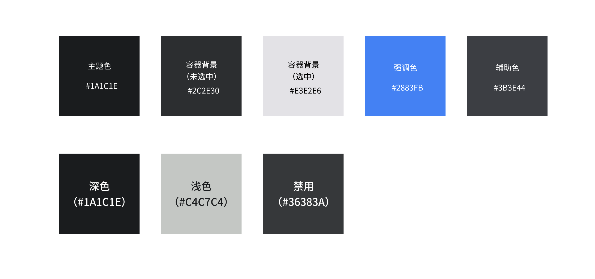

## UI组件库预览

AR眼镜应用的开发框架提供了一套全面的UI组件库，这些组件都经过精心设计和实现，以满足XR应用的特殊需求。这些组件不仅易于使用，而且可以高度定制，以适应各种设计语言和用户体验。

## UI组件封装思想

我们的UI组件库遵循模块化和可重用的设计原则。每个组件都被设计为一个独立的实体，具有明确的接口和可预见的行为。这使得开发者可以轻松地在各种上下文中使用这些组件，而不必担心依赖或冲突。

此外，我们的组件库强调可访问性和用户体验。所有的组件都设计得易于使用和理解，同时考虑到了各种可能的用户交互方式。我们的目标是为XR应用开发者提供一套强大的工具，使他们能够创建出引人入胜、易于使用的应用。

## UI组件色彩系统

## 组件类型介绍

以下是我们提供的主要UI组件：

1. **按钮(Button)**: 提供了基本的交互功能，如点击、长按等。可以自定义按钮的样式和动作。
2. **输入框(Input)**: 提供了文本输入功能，支持各种输入法，包括虚拟键盘和语音输入。
3. **列表项(List Item)**: 为列表提供了基本的单元。可以自定义列表项的内容和样式。
4. **列表(List)**: 显示一系列的列表项。支持垂直和水平滚动，以及各种滚动动画。
5. **列表选择器(List Picker)**: 提供了一个方便的界面，允许用户从一系列选项中选择一个。
6. **对话框(Dialog)**: 提供了一种模态的用户交互方式，可以显示警告、确认信息、或者提供一些选项供用户选择。
7. **应用内通知(Notification)**: 允许应用在不中断用户当前操作的情况下，向用户提供信息。
8. **状态栏(Status Bar)**: 显示应用的状态信息，如时间、电量、网络连接等。
9. **工具栏(Tool Bar)**: 提供了一种方便的方式，将常用的操作或导航选项放在用户容易访问的地方。
10. **卡片(Card)**: 提供了一种灵活的布局方式，可以包含各种内容，如文字、图片、按钮等。
11. **弹出菜单/弹层(Expand Layer)**: 提供了一种临时的、上下文相关的额外信息或操作选项。