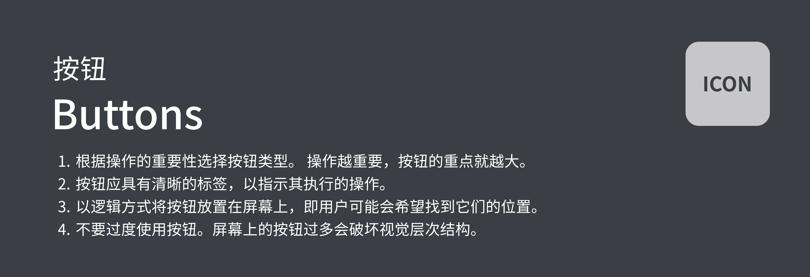
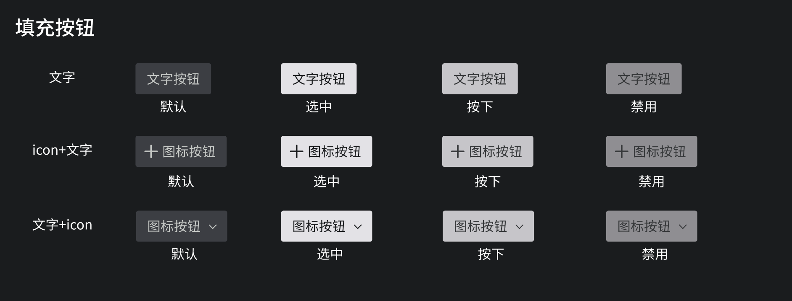
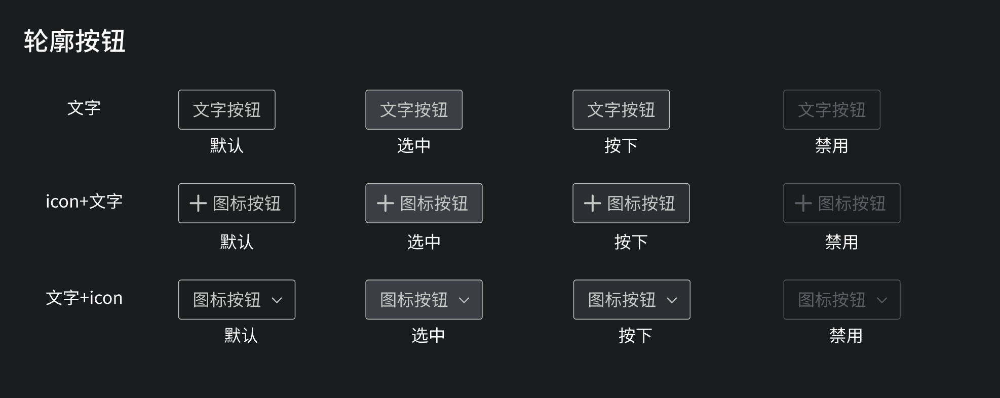

## Filled Button填充按钮

### 预览OVERVIEW



### 基础用法

```xml
<com.mst.basics.slide.widget.v2.GlassButton
    android:layout_width="wrap_content"
    android:layout_height="wrap_content"
    android:layout_marginEnd="@dimen/dp_10"
    app:sign="1"
    android:text="文字按钮" />
```

### 设置图标

```xml
<com.mst.basics.slide.widget.v2.GlassButton
    android:layout_width="wrap_content"
    android:layout_height="wrap_content"
    android:layout_marginEnd="@dimen/dp_10"
    app:sign="1"
    android:text="文字按钮"
    app:icon="@drawable/baseline_add"
    app:iconPosition="left" />
```

### 设置图标位置

```xml
<com.mst.basics.slide.widget.v2.GlassButton
    android:id="@+id/btn_9"
    android:layout_width="wrap_content"
    android:layout_height="wrap_content"
    android:layout_marginEnd="@dimen/dp_10"
    app:sign="1"
    android:text="文字按钮"
    app:icon="@drawable/baseline_arrow_forward_ios"
    app:iconPosition="right" />
```

## Outlined Button边框按钮



### 基础用法

```xml
<com.mst.basics.slide.widget.v2.GlassButton
    android:layout_width="wrap_content"
    android:layout_height="wrap_content"
    android:layout_marginEnd="@dimen/dp_10"
    app:sign="1"
    android:text="文字按钮"
		app:glassButtonStyle="outlined"/>
```

### 设置图标

```xml
<com.mst.basics.slide.widget.v2.GlassButton
    android:layout_width="wrap_content"
    android:layout_height="wrap_content"
    android:layout_marginEnd="@dimen/dp_10"
    app:sign="1"
    android:text="文字按钮"
    app:icon="@drawable/baseline_add"
    app:iconPosition="left"
		app:glassButtonStyle="outlined"/>
```

### 设置图标位置

```xml
<com.mst.basics.slide.widget.v2.GlassButton
    android:id="@+id/btn_9"
    android:layout_width="wrap_content"
    android:layout_height="wrap_content"
    android:layout_marginEnd="@dimen/dp_10"
    app:sign="1"
    android:text="文字按钮"
    app:icon="@drawable/baseline_arrow_forward_ios"
    app:iconPosition="right"
		app:glassButtonStyle="outlined"/>
```
