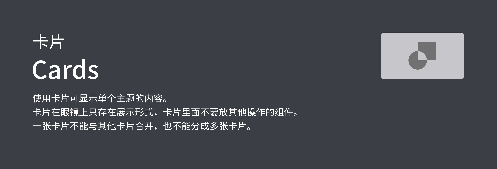
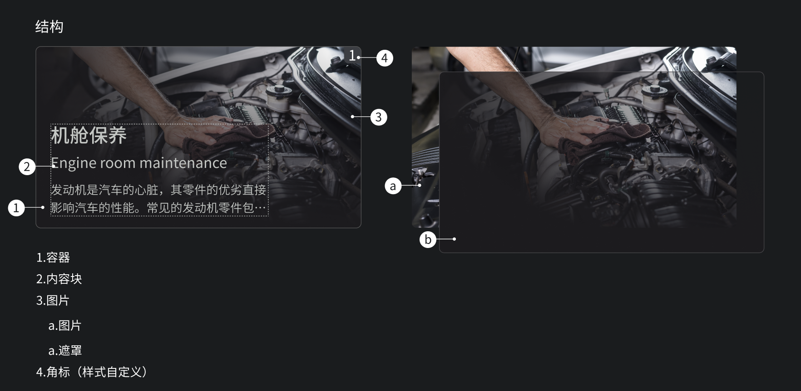

## 预览OVERVIEW



## 基础用法

```xml
<com.mst.basics.slide.widget.v2.GlassCard
    app:showSign="true"
    android:layout_width="@dimen/dp_200"
    android:layout_height="@dimen/dp_128">

    <androidx.appcompat.widget.LinearLayoutCompat
        android:tag="content"
        android:layout_width="match_parent"
        android:layout_height="match_parent">

        <TextView
            android:layout_width="match_parent"
            android:layout_height="match_parent"
            android:ellipsize="end"
            android:maxLines="5"
            android:textColor="@color/text_accent"
            android:text="测试内容测试内容测试内容测试内容测试内容测试内容测测试内容测试内容测测试内容测试内容测试内容测试内容测试内容测试内容测试内容测试内容测试内容测试内容测试内容测试内容测试内容测试内容测试内容测试内容测试内容测试内容测试内容测试内容测试内容测试内容测试内容" />
    </androidx.appcompat.widget.LinearLayoutCompat>


</com.mst.basics.slide.widget.v2.GlassCard>
```
