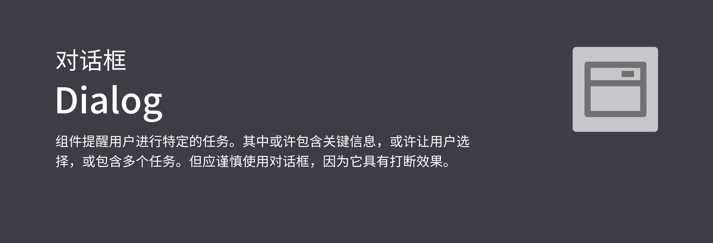
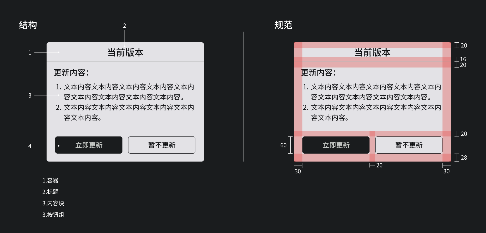

## 预览OVERVIEW



## 基础用法

```kotlin
GlassDialog(mContext, instructManager).apply {
    title = "当前版本"
    content = "1、文本内容文本内容文本内容文本内容文本内容文本内容文本内容文本内容文本内容。\n" +
            "2、文本内容文本内容文本内容文本内容文本内容文本内容。文本内容文本内容文本内容文本内容文本内容文本内容文本内容文本内容文本内容。\n" +
            "文本内容文本内容文本内容文本内容文本内容文本内容。文本内容文本内容文本内容文本内容文本内容文本内容文本内容文本内容文本内容。\n" +
            "文本内容文本内容文本内容文本内容文本内容文本内容。文本内容文本内容文本内容文本内容文本内容文本内容文本内容文本内容文本内容。\n" +
            "文本内容文本内容文本内容文本内容文本内容文本内容。"
    subTitle = "更新内容："
    confirmButton = Pair(InstructSingle("tui chu ying yong", "立即更新", "立即更新")) {
        toast("点击了确定")
    }
    cancelButton = Pair(InstructSingle("tui chu ying yong", "暂不更新", "暂不更新")) {
        toast("点击了取消")
    }
    wrapContent(widthPercent = 0.45)
    scroll = true
    show()
}
```

### 设置标题

```kotlin
GlassDialog DSL {
  ...
  title = "当前版本"
  ...
}
```

### 设置内容

```kotlin
GlassDialog DSL {
  ...
  content = "1、文本内容文本内容文本内容文本内容文本内容文本内容文本内容文本内容文本内容。\n" +
                        "2、文本内容文本内容文本内容文本内容文本内容文本内容。文本内容文本内容文本内容文本内容文本内容文本内容文本内容文本内容文本内容。\n" +
                        "文本内容文本内容文本内容文本内容文本内容文本内容。文本内容文本内容文本内容文本内容文本内容文本内容文本内容文本内容文本内容。\n" +
                        "文本内容文本内容文本内容文本内容文本内容文本内容。文本内容文本内容文本内容文本内容文本内容文本内容文本内容文本内容文本内容。\n" +
                        "文本内容文本内容文本内容文本内容文本内容文本内容。"
  ...
}
```

### 设置子标题

```kotlin
GlassDialog DSL {
  ...
  subTitle = "更新内容："
  ...
}
```

### 设置确定按钮

```kotlin
GlassDialog DSL {
  ...
  confirmButton = Pair(InstructSingle("tui chu ying yong", "立即更新", "立即更新")) {
                    toast("点击了确定")
                }
  ...
}
```

### 设置取消按钮

```kotlin
GlassDialog DSL {
  ...
  cancelButton = Pair(InstructSingle("tui chu ying yong", "暂不更新", "暂不更新")) {
                    toast("点击了取消")
                }
  ...
}
```

## 对话框的显示隐藏

```kotlin
GlassDialog DSL {
  ...
  show()
  dismiss()
}
```

## 设置对话框宽度(百分比)

```kotlin
GlassDialog DSL {
  ...
  wrapContent(widthPercent = 0.45)
  ...
}
```

## 设置自动滚动

```kotlin
GlassDialog DSL {
  ...
  scroll = true
  ...
}
```


