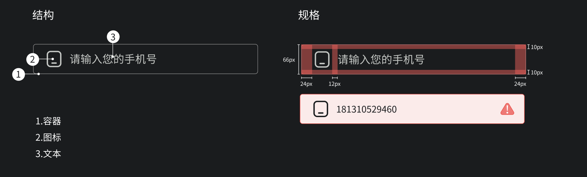

## 预览OVERVIEW



## 基础用法

```xml
<com.mst.basics.slide.widget.v2.GlassEditText
    android:id="@+id/edit_text1"
    android:layout_width="@dimen/dp_240"
    android:layout_height="wrap_content"
    app:inputType="text"
    app:placeholder="请输入您的账号"
    app:sign="54"
    android:layout_marginEnd="@dimen/dp_20"
    app:leftIcon="@drawable/baseline_account_circle" />

<com.mst.basics.slide.widget.v2.GlassEditText
    android:id="@+id/edit_text2"
    android:layout_width="@dimen/dp_240"
    android:layout_height="wrap_content"
    app:inputType="password"
    app:placeholder="请输入您的密码"
    app:sign="55"
    app:leftIcon="@drawable/baseline_app_registration" />
```

### 设置密码视图

```xml
app:inputType="password"
```

### 设置输入框图标

```xml
app:leftIcon="@drawable/baseline_app_registration"
```

### 设置输入框占位文本

```xml
app:placeholder="请输入您的密码"
```

### 监听输入文本

```kotlin
v.editText1.onTextEnterListener = {
    toast("输入的内容是：$it")
    v.editText1.errorStyle()
}
v.editText2.onTextEnterListener = {
    toast("输入的内容是：$it")
}
```

### 设置输入错误样式

```kotlin
v.editText1.errorStyle()
```
