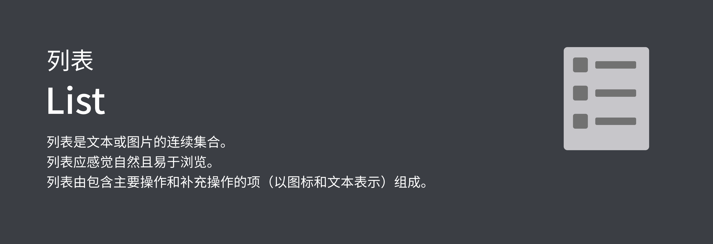
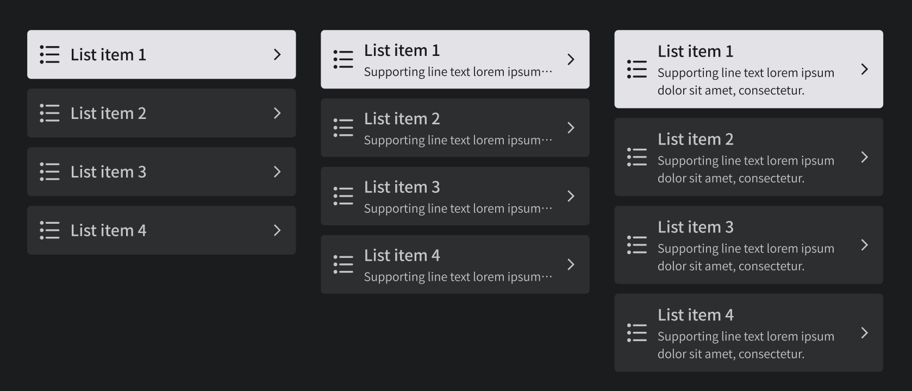

## 预览OVERVIEW



## 基础用法

```xml
<com.mst.basics.slide.widget.v2.GlassListView
    android:id="@+id/glass_list_view1"
    android:layout_width="@dimen/dp_300"
    android:layout_height="wrap_content"
    app:visibleSign="false"
    app:listLayoutManager="androidx.recyclerview.widget.LinearLayoutManager" />
```

```kotlin
v.glassListView1.refreshList(
    listOf(
        GlassListView.Companion.ItemData(
            "List item 1",
            "Supporting line text lorem ipsum dolor sit amet, consectetur.",
            null,
            "33",
            true
        ),
        GlassListView.Companion.ItemData(
            "List item 2",
            "Supporting line text lorem ipsum dolor sit amet, consectetur.",
            null,
            "34",
            true
        ),
        GlassListView.Companion.ItemData(
            "List item 3",
            "Supporting line text lorem ipsum dolor sit amet, consectetur.",
            R.drawable.baseline_align_horizontal_right,
            "35",
            true
        ),
        GlassListView.Companion.ItemData(
            "List item 4",
            "Supporting line text lorem ipsum dolor sit amet, consectetur.",
            R.drawable.baseline_align_horizontal_right,
            "36",
            true
        )
    )
)
```

### 刷新或载入数据

```kotlin
open fun refreshList(list: List<ItemData>)
```

### 是否显示语音指令标记

```kotlin
open fun showSign(show: Boolean)
```

### 设置Item项点击事件监听

```kotlin
open fun setOnItemClickListener(listener: RecyclerViewBindingAdapter.OnItemClickListener<ItemData>)
```
