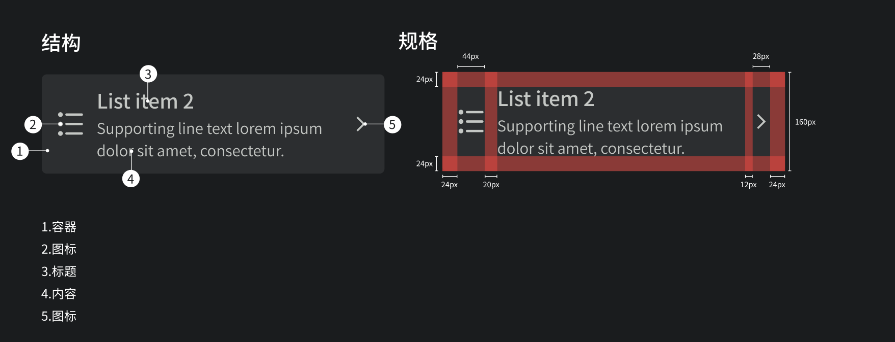

## 预览OVERVIEW



## 基础用法

```xml
<com.mst.basics.slide.widget.v2.GlassListItemView
    android:layout_width="@dimen/dp_300"
    android:layout_height="wrap_content"
    android:layout_marginBottom="@dimen/dp_10"
    android:layout_marginStart="@dimen/dp_10"
    app:title="List item 2"
    app:sign="31"
    app:subtitle="Supporting line text lorem ipsum dolor sit amet, consectetur."
    app:leftIcon="@drawable/baseline_apartment_24">

    <androidx.appcompat.widget.AppCompatImageView
        android:tag="right"
        android:layout_width="@dimen/dp_14"
        android:layout_height="@dimen/dp_14"
        android:src="@drawable/baseline_arrow_forward_ios"
        android:tint="#c0c4c1" />
</com.mst.basics.slide.widget.v2.GlassListItemView>
```

## 组件选项

```xml
<declare-styleable name="GlassListItemView">
    <attr name="leftIcon" />
    <attr name="title" />
    <attr name="subtitle" format="string" />
    <attr name="singleLine" format="boolean" />
    <attr name="sign" />
    <attr name="showSign" />
</declare-styleable>
```

### 单行列表项

```xml
<com.mst.basics.slide.widget.v2.GlassListItemView
    android:id="@+id/glass_list_item_view_1"
    android:layout_width="@dimen/dp_300"
    android:layout_height="wrap_content"
    android:layout_marginBottom="@dimen/dp_10"
    android:layout_marginStart="@dimen/dp_10"
    app:title="List item 0"
    app:singleLine="true"
    app:sign="25"
    app:subtitle="Supporting line text lorem ipsum dolor sit amet, consectetur.">
```

### 设置右侧图标

```xml
<com.mst.basics.slide.widget.v2.GlassListItemView
    android:layout_width="@dimen/dp_300"
    android:layout_height="wrap_content"
    android:layout_marginBottom="@dimen/dp_10"
    android:layout_marginStart="@dimen/dp_10"
    app:title="List item 0"
    app:singleLine="true"
    app:sign="27"
    app:subtitle="Supporting line text lorem ipsum dolor sit amet, consectetur.">

    <androidx.appcompat.widget.AppCompatImageView
        android:tag="right"
        android:layout_width="@dimen/dp_14"
        android:layout_height="@dimen/dp_14"
        android:src="@drawable/baseline_arrow_forward_ios"
        android:tint="#c0c4c1" />
</com.mst.basics.slide.widget.v2.GlassListItemView>
```

### 设置左侧图标

```xml
<com.mst.basics.slide.widget.v2.GlassListItemView
    android:layout_width="@dimen/dp_300"
    android:layout_height="wrap_content"
    android:layout_marginBottom="@dimen/dp_10"
    android:layout_marginStart="@dimen/dp_10"
    app:title="List item 2"
    app:singleLine="true"
    app:sign="29"
    app:subtitle="Supporting line text lorem ipsum dolor sit amet, consectetur."
    app:leftIcon="@drawable/baseline_apartment_24">

    <androidx.appcompat.widget.AppCompatImageView
        android:tag="right"
        android:layout_width="@dimen/dp_14"
        android:layout_height="@dimen/dp_14"
        android:src="@drawable/baseline_arrow_forward_ios"
        android:tint="#c0c4c1" />
</com.mst.basics.slide.widget.v2.GlassListItemView>
```
