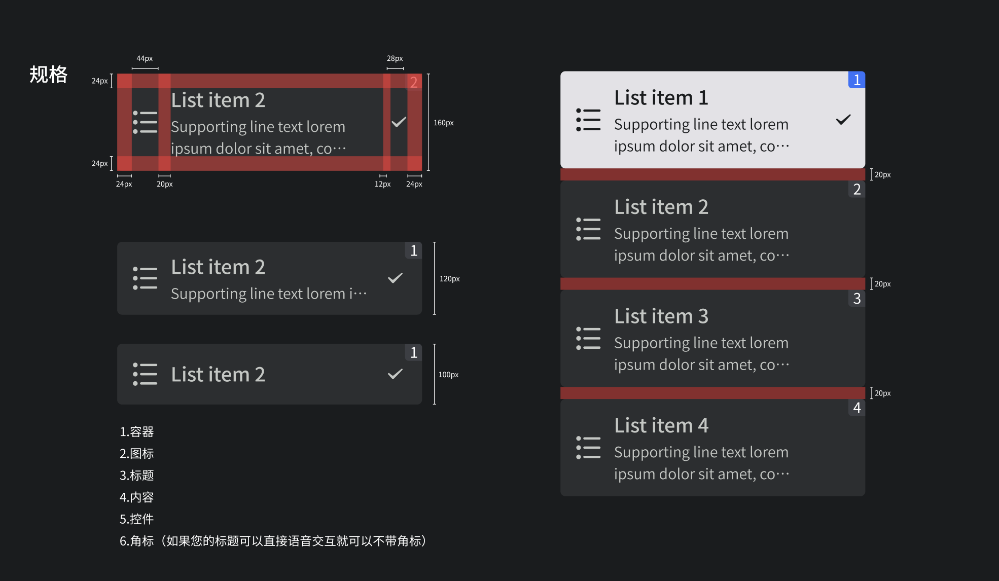

## 预览OVERVIEW



## 基础用法

```xml
<com.mst.basics.slide.widget.v2.GlassListView
    android:id="@+id/glass_list_view1"
    android:layout_width="@dimen/dp_300"
    android:layout_height="wrap_content"
    app:visibleSign="false"
    app:singleSelect="true"
    app:rightViewClass="com.mst.basics.slide.widget.other.ImageCompoundButton"
    app:listLayoutManager="androidx.recyclerview.widget.LinearLayoutManager" />

<com.mst.basics.slide.widget.v2.GlassListView
    android:id="@+id/glass_list_view2"
    android:layout_width="@dimen/dp_300"
    android:layout_height="wrap_content"
    android:layout_marginStart="@dimen/dp_10"
    app:visibleSign="false"
    app:rightViewClass="com.google.android.material.materialswitch.MaterialSwitch"
    app:listLayoutManager="androidx.recyclerview.widget.LinearLayoutManager" />
```

### 设置右侧选择器样式

#### ImageCompoundButton

```xml
app:rightViewClass="com.mst.basics.slide.widget.other.ImageCompoundButton"
```

#### MaterialSwitch

```xml
app:rightViewClass="com.google.android.material.materialswitch.MaterialSwitch"
```

#### MaterialRadioButton

```xml
app:rightViewClass="com.google.android.material.radiobutton.MaterialRadioButton"
```

### 设置选择器多选

```xml
<com.mst.basics.slide.widget.v2.GlassListView
    android:id="@+id/glass_list_view3"
    android:layout_width="@dimen/dp_300"
    android:layout_height="wrap_content"
    app:visibleSign="true"
    app:singleSelect="true"
    app:rightViewClass="com.google.android.material.radiobutton.MaterialRadioButton"
    app:listLayoutManager="androidx.recyclerview.widget.LinearLayoutManager" />

<com.mst.basics.slide.widget.v2.GlassListView
    android:id="@+id/glass_list_view4"
    android:layout_width="@dimen/dp_300"
    android:layout_height="wrap_content"
    android:layout_marginStart="@dimen/dp_10"
    app:visibleSign="true"
    app:multiSelect="true"
    app:rightViewClass="com.google.android.material.checkbox.MaterialCheckBox"
    app:listLayoutManager="androidx.recyclerview.widget.LinearLayoutManager" />
```
