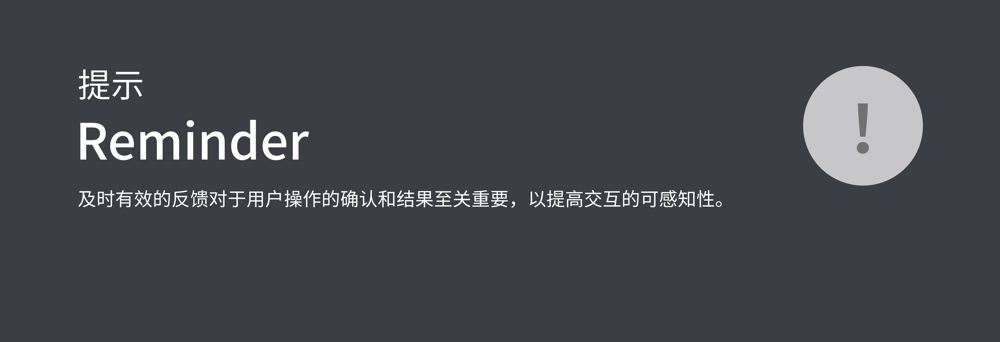
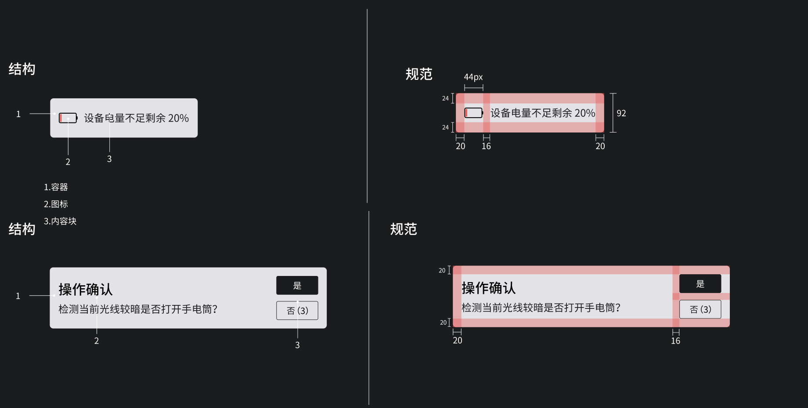

## 预览OVERVIEW



## 基础用法

```kotlin
GlassNotification(mContext, instructManager).apply {
    icon = ContextCompat.getDrawable(mContext, R.drawable.baseline_apartment_24)
    title = "提示"
    content = "这是一个带标题的提示框"
    durationMills = 3
    show()
}
```

### 设置左侧图标

```kotlin
GlassNotification DSL {
  ...
  icon = ContextCompat.getDrawable(mContext, R.drawable.baseline_apartment_24)
  ...
}
```

### 设置标题

```kotlin
GlassNotification DSL {
  ...
  title = "提示"
  ...
}
```

### 设置内容

```kotlin
GlassNotification DSL {
  ...
  content = "这是一个带标题的提示框"
  ...
}
```

### 设置消失倒计时

```kotlin
GlassNotification DSL {
  ...
  durationMills = 3
  ...
}
```

### 设置操作按钮


```kotlin
GlassNotification(mContext, instructManager).apply {
    content = "检测当前光线较暗是否打开手电筒？"
    confirmButton = Pair(InstructSingle("que ding", "确定", "Confirm")) {
        toast("点击了确定")
    }
    cancelButton = Pair(InstructSingle("qu xiao", "取消", "Cancel")) {
        toast("点击了取消")
    }
    durationMills = 3
    show()
}
```
