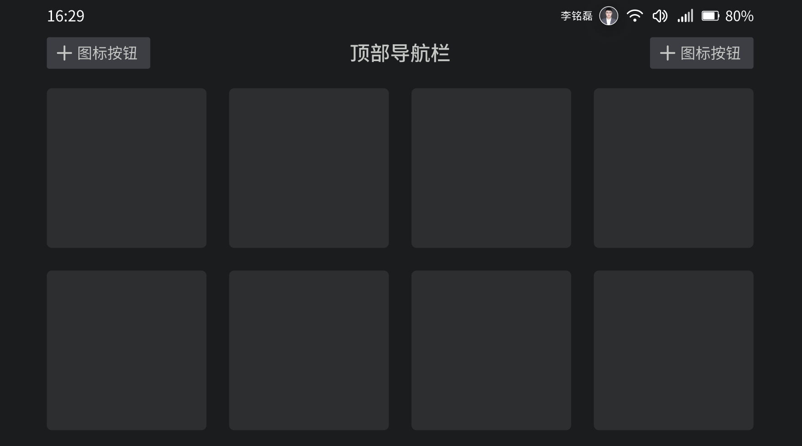

## 预览OVERVIEW



## 基础用法

```xml
<com.mst.basics.slide.widget.v2.GlassToolbar
    android:id="@+id/toolbar"
    android:layout_width="match_parent"
    android:layout_height="wrap_content"
    app:title="顶部导航栏"
    app:leftIcon="@drawable/baseline_arrow_back_ios"
    app:leftIconGravity="left" />
```
