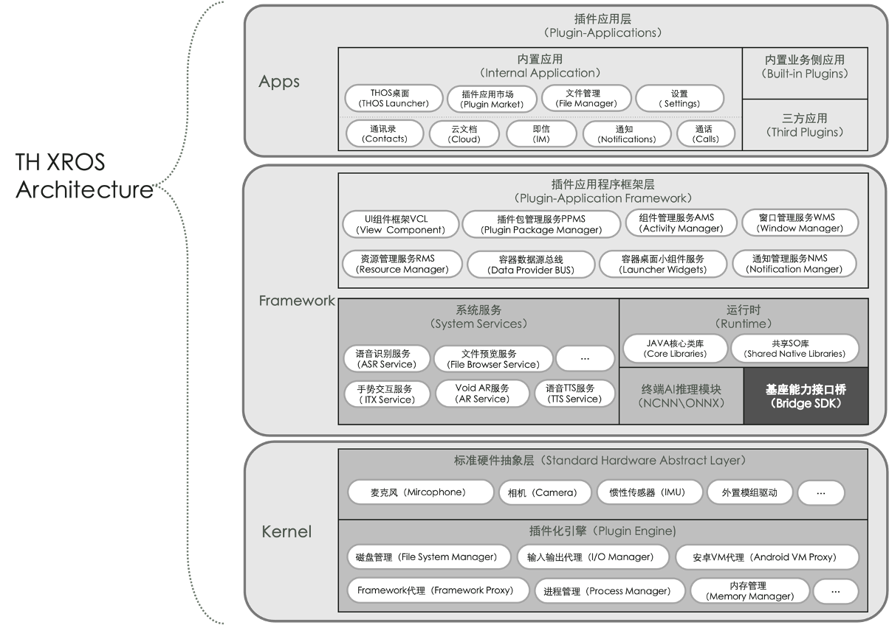

## 预期特性

:::info

1. 支持私有化远程交付解决方案。
2. 统一市场上主流XR眼镜设备的交互操作。
3. 提供标准语音指令控制和硬件能力接口。
4. 支持AI终端推理能力，包括各种常用模型。
5. 管理插件的通知消息和提供Launcher桌面组件注册接口。
6. 支持第三方开发者接入和适配市场上主流XR眼镜硬件。

:::

## 生态架构图

### Framework - 插件应用程序框架层
#### 插件应用程序框架层

- 组件管理服务AMS
  - 开发和维护组件管理服务，以支持应用的组件管理。
  - 确保组件的注册、启动和生命周期管理。
- 窗口管理服务WMS
  - 实现窗口管理服务，以支持应用的窗口控制和多任务处理。
  - 确保窗口的布局、切换和层叠功能。
- 资源管理服务RMS
  - 开发资源管理服务，以支持应用资源的加载和释放。
  - 确保资源的优化和内存管理。
- UI组件框架层VCL
  - 开发UI组件框架，以支持应用的用户界面设计。
  - 提供UI组件库和界面元素
- 容器数据源总线DP BUS
  - 实现容器数据源总线，以支持数据的传输和共享。
  - 提供数据源注册和数据传输功能。
- 插件包管理服务PPMS
  - 开发插件包管理服务，以支持应用插件的安装和管理。
  - 提供插件包的下载和升级功能。
- 桌面小组件服务LWS
  - 开发桌面小组件服务，以支持小组件的添加和管理。
  - 提供小组件库和界面定制功能。 
- 通知管理服务NMS
  - 实现通知管理服务，以支持应用的通知推送和管理。
  - 确保通知的可视化和交互功能。

#### 插件平台系统服务

- 语音识别服务 **【厂商语音识别集成融合】**
  - 融合各厂商语音识别服务，以支持语音交互功能。
  - 缺失语音能力的设备集成语音识别引擎和语音指令解析。
- 手势交互服务 **【暂不支持】**
  - 实现手势交互服务，以支持手势控制功能。
  - 设计手势识别算法和交互反馈。
- 文件预览服务 **【基座基础服务】**
  - 开发文件预览服务，以支持文件浏览和预览功能。
  - 提供文件格式支持和浏览界面。
- Void AR服务 **【基座基础服务】**
  - 实现虚拟和增强现实服务，以支持AR体验。
  - 集成AR引擎和AR应用功能。
- 语音TTS服务 **【基座基础服务】**
  - 开发语音合成服务，以支持文字转语音功能。
  - 提供多语言支持和发音控制。
- 终端AI推理服务 **【未来开放】**
  - 集成NCNN和ONNX等AI推理模块，以支持各种AI应用。
  - 提供AI模型加载和推理功能。

- 第三方设备厂商SDK **【基座基础SDK】**
  - 集成第三方设备厂商的SDK，以支持各种硬件设备。
  - 提供设备驱动和接口封装（相机、麦克风）。

- 第三方设备厂商  **【Native核心类库】**
  - 集成第三方设备厂商的SDK，以支持底层硬件访问和驱动（谦视、亮亮视野SDK、拜特尔、rokid glass2等插入式设备）。
  - 提供硬件抽象层和接口封装。

### Apps - 基座应用层

#### 内置应用

- 桌面Launcher **【基座基础应用开发】**
  - 开发THOS桌面应用，包括界面设计 和用户体验。
  - 集成基础功能如应用启动、插件管理。
  - 测试和优化桌面性能。
- 插件应用市场Plugin Market **【基座基础应用开发】**
  - 开发插件应用市场，包括应用提交和审核流程。
  - 开发用户界面，应用搜索和分类功能。
  - 提供应用下载和更新功能。
- 文件管理器File Manager **【基座基础应用开发】**
  - 开发文件管理器应用，包括文件浏览和操作功能。
  - 支持文件上传、下载、复制、移动等操作。
  - 提供界面优化，以适配XR设备。
- 设置Settings **【基座开发】**
  - 开发设置应用，包括系统设置和应用设置。
  - 设计和实现用户友好的设置界面。
  - 确保各项设置功能正常工作。
- 通知Notifications **【基座开发】**
  - 开发通知管理应用，包括通知推送和管理功能。
  - 提供通知筛选和优先级设置。
  - 确保通知的实时性和可靠性。

### Kernel - 基座核心插件化

- 标准硬件抽象层 **【C++ Native层处理】**
  - 开发标准硬件抽象层，以支持各种硬件设备的访问和控制。
  - 集成麦克风、相机、IMU等硬件驱动。
- 插件化引擎 **【C++ Native层处理、Framework层Hook】**
  - 开发插件化引擎，以支持插件应用的隔离和执行。
  - 提供插件化框架和运行时环境。
- 磁盘管理 **【C++ Native层处理、Framework层Hook】**
  - 实现磁盘管理模块，以支持文件系统操作。
  - 提供文件读写和存储管理。
- Framework代理 **【Framework层Hook】**
  - 开发Framework代理，以实现插件应用与基座系统的交互。
  - 提供请求和响应代理功能。
- IO代理 **【C++ Native层处理】**
  - 实现输入输出代理，以支持硬件设备的输入输出。
  - 提供输入事件和数据传输代理。
- 进程管理 **【C++ Native层处理**】
  - 开发进程管理模块，以支持应用进程的创建和管理。
  - 提供进程隔离和通信功能（Ptrace进程重命名、进程占坑式伪代理）。
- 安卓VM代理 **【Framework层Hook、历代安卓版本Framework层差异兼容】**
  - 实现Android VM代理，以支持Android应用的运行。
  - 提供Android环境的模拟和支持。
- 内存管理【**C++** **Native层处理**】
  - 开发内存管理模块，以支持内存资源的分配和释放（主要是native内存的切割和共享内存的隔离处理，涉及到内存块锁机制）。
  - 提供内存优化和资源管理。
