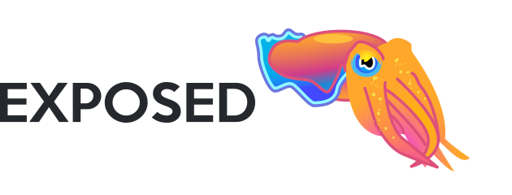
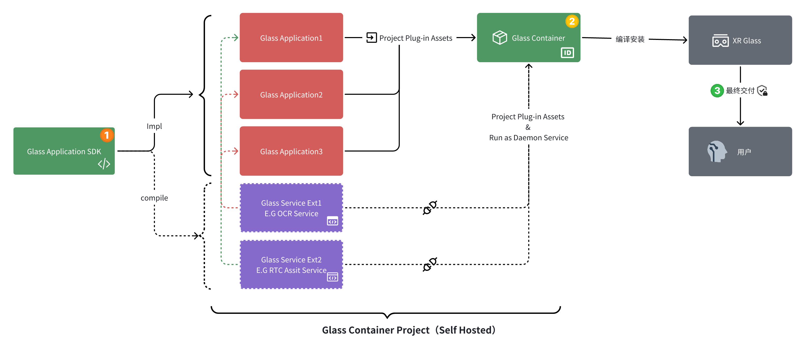

 
 

> `Glass Plugin Container` 是基于`Android Framework`虚拟化的沙盒系统，使应用程序模块化，更易扩展和维护，实现免安装

:::info

我们设计的`Glass Plugin Container`是完全依据⽤户空间构建的⼀个虚拟容器，第三方开发者可以将各类场景解决⽅案以容器内插件内置、或以应⽤市场形式下发，并可依此能⼒完成场景应⽤的私有化远程交付。

现在我们将`Glass Plugin Container`的核心功能对外共享，将核心实现以`Glass PluginCore SDK`对外开放。`Glass PluginCore SDK`
是一个专用于XR设备的Android应用程序虚拟化框架，它允许用户在无需安装的情况下运行任何应用程序，从而实现了应用程序（场景解决方案交付包）的"
插件化"。它通过创建一个虚拟的环境，模拟Android系统的各种服务和组件，以实现在这个环境中运行应用程序。

:::

## 研发初衷

实现免安装运行APK，并将核心能力抽象为服务作为独立的APK插件加载独立维护，可以实现远程动态加载业务APK，并自由调用容器内的APK服务，这便是`Glass Plugin Container`
的研发初衷。

## 与GlassApplicationSDK的关系

以上的架构图能很好地表达出`Glass Application SDK`与`Glass Plugin Container`之间的关系。

:::tip

`Glass Application SDK`
：开发XR眼镜应用最基础的SDK包。包含XR应用开发基础所需的所有套件，主要为统一交互逻辑和适用于XR眼镜的UI组件。目的是为开发者提供统一的硬件交互接口、为用户在各厂商AR硬件上带来更一致使用体验。

`Glass Plugin Container`：提供插件化能力的基础容器，用于实现免安装运行XR眼镜插件应用，可依托此实现插件APK（场景解决方案包）的远程下发和免安装运行，可对已安装插件应用进行完全管理的一个基础容器。

:::

## 容器的提供形式

`Glass Plugin Container`对第三方开发者的提供形式为`Glass Plugin Container SDK`，包含了`Glass Plugin Container`
插件化容器的所有核心代码的一个方便容器做OEM定制开发的一个`OEM SDK`。下文所涉及到API章节全部是`Glass Plugin Container SDK`
包含的API，开发者依赖了`Glass Plugin Container SDK`之后就可以以OEM的形式定制自己的插件化容器。

:::tip

运行在Glass上的插件化容器实际就是包含了插件化功能的特殊的Glass应用，因此开发方式基本与Glass应用相同，都需要集成`Glass Application SDK`
，插件化容器开发需要额外依赖`Glass Plugin Container SDK`。

:::

