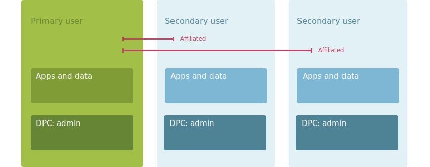
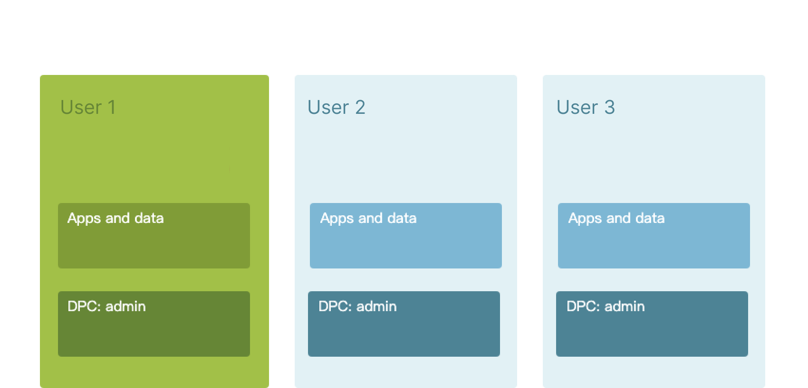

## 安卓系统中的多用户空间

在Android系统中，多用户空间是一个非常有用的特性，它允许设备的不同用户拥有自己的个人化环境和数据。这种特性在平板电脑或共享设备的情况下尤其有价值。从Android 4.2（Jelly Bean）开始，Android开始支持多用户功能。

[管理多个用户  | Android 开发者  | Android Developers (google.cn)](https://developer.android.google.cn/work/dpc/dedicated-devices/multiple-users?hl=lt)

以下是从安卓开发者角度来看待多用户空间的一些主要观点：

1. **用户和用户空间**：每个用户都有自己的用户空间，包括一组特定的系统设置、应用程序和相关数据。每个用户空间都是独立的，保护了各个用户的隐私。
2. **应用程序和数据隔离**：每个用户的应用程序和数据都是分开的。一个用户安装的应用程序不会出现在另一个用户的用户空间中，除非另一个用户也安装了同样的应用程序。同样，一个用户的应用数据是不可见的，不能被另一个用户访问。
3. **应用程序生命周期**：对于运行在前台的用户，系统会优先分配资源。当用户切换时，系统会将之前用户的应用程序转移到后台，可能会被系统暂停或停止。开发者需要处理好这些生命周期事件，以确保应用程序的正常运行和数据的完整性。
4. **用户切换**：用户可以在系统设置中切换用户。应用程序需要能够处理用户切换的情况，例如，当用户切换时，可能需要保存当前状态，然后在新用户登录时恢复这些状态。
5. **权限和安全**：每个用户都有自己的安全上下文，包括一组特定的权限和访问控制。应用程序需要在每个用户的上下文中分别请求和管理权限。
6. **测试和调试**：开发者需要测试在多用户环境中的应用程序行为，包括数据隔离、权限管理、用户切换等情况。Android提供了一些工具和API来帮助开发者在多用户环境中测试和调试应用程序。

***
图1. 由同一 DPC 中的管理员管理的主要和次要用户 
***

## 扩展到Glass Plugin容器

同样的，参考安卓多用户的概念和实际需求，我们为`Glass Plugin Container`也设计了多用户空间的概念。不同用户空间之间安装的App和数据相互隔离，同一空间内的App可以相互通信，以满足某些场景下多用户需求，为用户提供更多的个性化体验和数据安全保障。

***
图2. Glass Plugin容器多用户结构 
***

>  以下是在`Glass Plugin Container`中实现多用户空间的一些可能的应用场景和优点。

:::info

1. **共享设备**：针对现有企业中的XR设备使用，绝大多数受限于XR设备价格，人们可能会共享同一台设备。在这种情况下，多用户空间可以确保每位员工都有自己的个性化环境，包括安装的应用程序和个人数据。这可以提高设备的使用效率，同时保护每个员工的数据安全。
2. **个性化体验**：依托多用户空间，每位用户都可以根据自己的需求和喜好，安装和配置应用程序，排列他的启动页`Launcher`。这使得每个用户都可以获得独特的、个性化的使用体验。
3. **数据安全**：由于每个用户的数据都是隔离的，因此即使一个用户的数据被破坏或泄露，也不会影响到其他用户。这大大增强了数据的安全性。
4. **测试和开发**：开发者可以在一个用户空间中安装和测试新的或未发布的应用程序，而不会影响到其他用户空间的稳定性和数据完整性。
5. **权限管理**：每个用户空间都有自己的权限设置，这使得设备的管理员可以根据需要，为每个用户配置不同的应用访问权限。例如，公司可以限制员工访问某些敏感信息。
6. **节省存储空间**：在多用户空间中，同一个应用程序的代码只需要存储一次，但每个用户的数据是隔离的。这样既可以节省存储空间，又可以保证数据的隔离性。

:::
