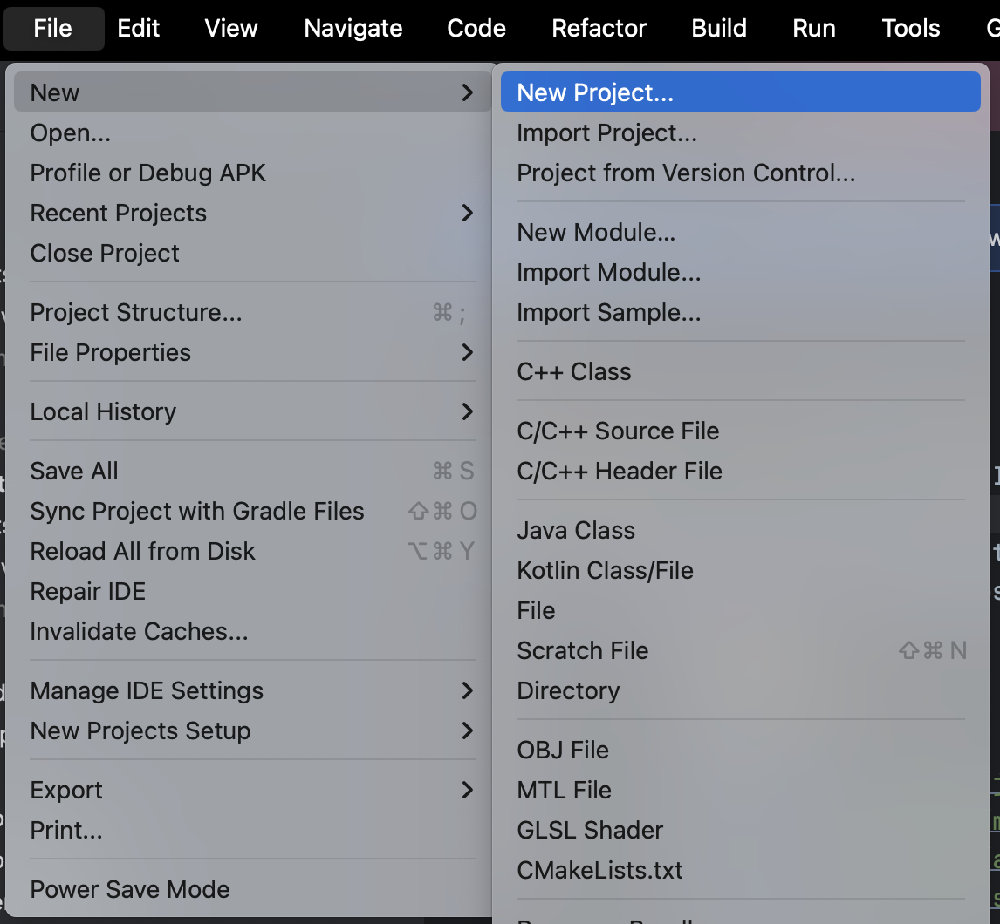
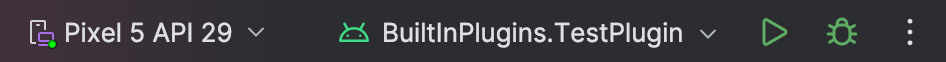
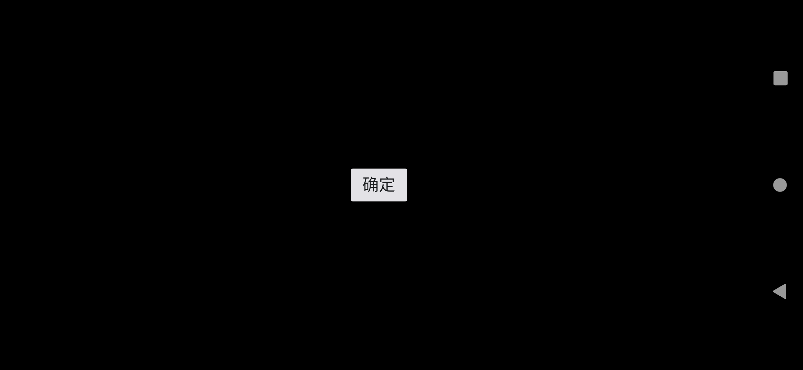

:::tip

运行在Glass上的插件化容器实际就是包含了插件化功能的特殊的Glass应用，因此开发方式基本与Glass应用相同，都需要集成`Glass Application SDK`。

:::

## 环境要求

- [x] **系统要求：** `Windows 10 +`  `macOS 10.14 +`  `Linux 发行版 (Arch/Debian)`
- [x] **IDE要求：** `Android Studio 2021.1 +`
- [x] **Kotlin：** `Kotlin 1.7.0 +`
- [x] **AGP：** `Android Gradle Plugin 7.0 +`
- [x] **Gradle：** `Gradle 7.0 +`
- [x] **JDK：** `Java 11 +`

## 创建项目

创建新项目。详见 [Create a project](https://developer.android.com/studio/projects/create-project)。

1. 打开 `Android Studio`，选择 `New Project`。

<p align="center"></p>

2. 选择 **Phone and Tablet > Empty Views Activity**，点击 **Next**。

<p align="center"></p>

3. 设置项目名称和存储路径，选择语言为**Kotlin/Java**，点击 **Finish** 创建 Android 项目。

::: info

创建项目后，**Android Studio** 会自动开始同步 gradle，稍等片刻至同步成功后再进行下一步操作。

:::

## 集成依赖

1. 打开项目根目录下的 `settings.gradle` 文件，添加 Maven Central 依赖 (如果已有可忽略)：

   ```gradle
   maven { url("http://maven.teamhelper.cn:8081/repository/MST/") }
   ```

   ::: warning

   如果你的 Android
   项目设置了 [dependencyResolutionManagement](https://docs.gradle.org/current/userguide/declaring_repositories.html#sub:centralized-repository-declaration)
   ，添加 Maven Central 依赖的方式可能存在差异。
   :::


2. 打开 `/app/build.gradle` 文件，在 `dependencies` 中同时添加`Glass Application SDK`和`Glass Plugin Container`
   的依赖。你可以从[版本路线](/api/1.x/)中查询`Glass Application SDK`和`Glass Plugin Container`
   的最新版本，并将 `<LatestVersion> `替换为具体的版本号。
   :::: code-group
   ::: code-group-item Gradle Groovy DSL

    ```gradle
   dependencies {
   		 implementation 'com.teamhelper.xr:glass-sdk:<LatestVersion>'
       implementation 'com.teamhelper.xr:glass-plugin-container:<LatestVersion>'
       ...
   }
    ```

   :::
   ::: code-group-item Gradle Kotlin DSL

    ```kotlin
   dependencies {
     	 implementation("com.teamhelper.xr:glass-sdk:<LatestVersion>")
       implementation("com.teamhelper.xr:glass-plugin-container:<LatestVersion>")
       ...
   }
    ```

   :::
   ::::

   ::: info

   如果创建项目时项目语言选为Java，需要额外为模块配置Kotlin支持。

   :::

## 配置Java版本

在你的项目 `build.gradle.kts` 或 `build.gradle` 中修改 Kotlin 的 Java 版本为 17 及以上。

:::: code-group
::: code-group-item Gradle Groovy DSL

```gradle
android {
    compileOptions {
        sourceCompatibility JavaVersion.VERSION_17
        targetCompatibility JavaVersion.VERSION_17
    }
    kotlinOptions {
        jvmTarget = '17'
    }
}
```

:::
::: code-group-item Gradle Kotlin DSL

```kotlin
android {
    compileOptions {
        sourceCompatibility = JavaVersion.VERSION_17
        targetCompatibility = JavaVersion.VERSION_17
    }
    kotlinOptions {
        jvmTarget = "17"
    }
}
```

:::
::::

## 开始使用

1. 创建自定义`Application`类继承自`GlassBaseApplication`，并在`AndroidManifest.xml`中注册你自定义的`Application`
   类，将`App`的`theme`继承改为`Glass SDK`中的`Theme.Base.Glass`

   :::: code-group
   ::: code-group-item App.kt

   ```kotlin
   import com.mst.basics.GlassBaseApplication
   
   class App : GlassBaseApplication()
   ```

   :::
   ::: code-group-item App.java

   ```java
   import com.mst.basics.GlassBaseApplication;
   
   public class App extends GlassBaseApplication { }
   ```

   :::
   ::::

   :::: code-group
   ::: code-group-item AndroidManifest.xml

   ```xml
   <?xml version="1.0" encoding="utf-8"?>
   <manifest xmlns:android="http://schemas.android.com/apk/res/android">
   
       <application
           ...
           android:name="<your_package>.App"
           android:theme="@style/Theme.TestPlugin">
           ...
       </application>
   
   </manifest>
   ```

   :::
   ::::

   :::: code-group
   ::: code-group-item themes.xml

   ```xml
   <resources>
       <style name="Theme.TestPlugin" parent="Theme.Base.Glass" />
   </resources>
   ```

   :::
   ::::

2. 创建一个新的`Activity`继承自`GlassBaseActivity`，重写`initView`方法，操作UI组件设置语音指令和点击事件，并通过focus()
   方法聚焦为当前的操作焦点。关于[交互逻辑](/docs/basic_framework/交互逻辑.html)
   和[UI组件](/docs/basic_framework/UI组件.html)的详细描述见API文档当中的相关描述。
   :::: code-group
   ::: code-group-item MainActivity.kt

   ```kotlin
   class MainActivity : GlassBaseActivity<ActivityMainBinding,    EmptyViewModel>() {
   
       override fun initParams() {
   
       }
   
       override fun initData() {
   
       }
   
       override fun initView() {
         	// v为ActivityMainBinding:ViewDataBinding的实例
           v.btnConfirm.setInstruct(InstructSingle("que ding", "确定", "confirm"))
           v.btnConfirm.setOnClickListener {
               toast("confirm")
           }
           v.btnConfirm.focus()
       }
   
       override fun registerObserve() {
   
       }
   }
   ```

   :::
   ::::

   :::: code-group
   ::: code-group-item activity_main.xml

   ```xml
   <?xml version="1.0" encoding="utf-8"?>
   <layout>
   
       <androidx.constraintlayout.widget.ConstraintLayout xmlns:android="http://schemas.android.com/apk/res/android"
           xmlns:app="http://schemas.android.com/apk/res-auto"
           xmlns:tools="http://schemas.android.com/tools"
           android:layout_width="match_parent"
           android:layout_height="match_parent"
           tools:context=".MainActivity">
   
           <com.mst.basics.slide.widget.v2.GlassButton
               android:id="@+id/btn_confirm"
               app:sign="1"
               app:layout_constraintStart_toStartOf="parent"
               app:layout_constraintTop_toTopOf="parent"
               app:layout_constraintEnd_toEndOf="parent"
               app:layout_constraintBottom_toBottomOf="parent"
               android:layout_width="wrap_content"
               android:layout_height="wrap_content"
               android:text="确定" />
   
       </androidx.constraintlayout.widget.ConstraintLayout>
   </layout>
   ```

   :::
   ::::

3. 点击`▶️运行`，不出意外你即可得到如下运行结果，至此你已经成功接入了`Glass Application SDK`
   ，接下来你可以详细阅读API文档，了解`Glass Application SDK`的[交互逻辑](/docs/basic_framework/交互逻辑.html)
   和[UI组件封装](/docs/basic_framework/UI组件.html)。

   <p align="center"></p>

   <p align="center">
   </p>

## 示例工程

你也可以通过Git拉取我们的示例项目快速上手`Glass Plugin Container`。

```bash
git clone https://github.com/Teamhelper/glass-plugin-container-example.git
```

