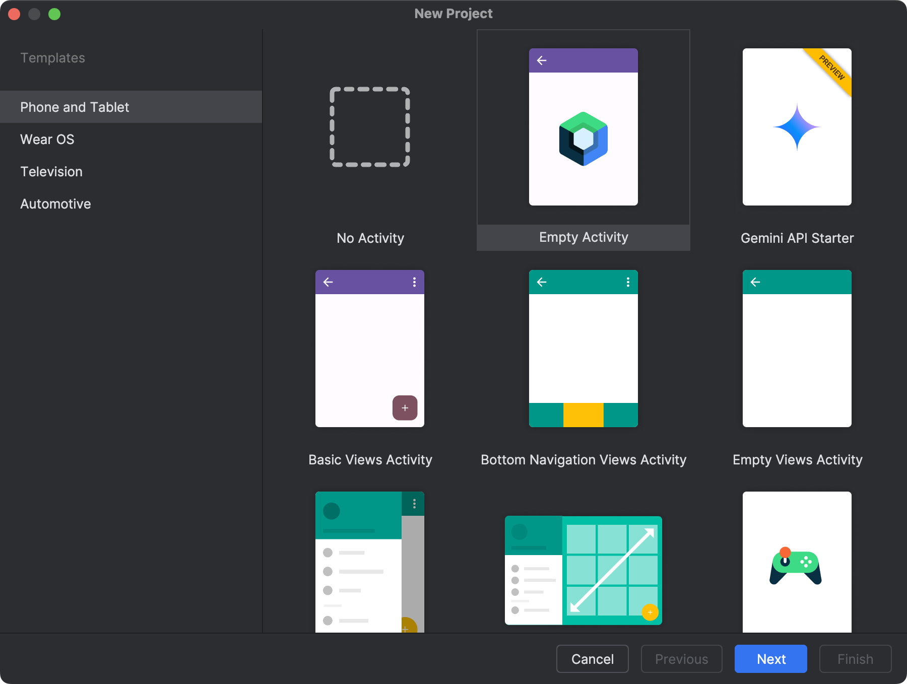

:::tip

运行在Glass上的插件化容器实际就是包含了插件化功能的特殊的Glass应用，因此开发方式基本与Glass应用相同，都需要集成`Glass Application SDK`。

:::

## 环境要求

- [x] **系统要求：** `Windows 10 +`  `macOS 10.14 +`  `Linux 发行版 (Arch/Debian)`
- [x] **IDE要求：** `Android Studio 2021.1 +`
- [x] **Kotlin：** `Kotlin 1.7.0 +`
- [x] **AGP：** `Android Gradle Plugin 7.0 +`
- [x] **Gradle：** `Gradle 7.0 +`
- [x] **JDK：** `Java 11 +`

## 创建项目

创建新项目。详见 [Create a project](https://developer.android.com/studio/projects/create-project)。

1. 打开 `Android Studio`，选择 `New Project`。

<p align="center"></p>

2. 选择 **Phone and Tablet > Empty Views Activity**，点击 **Next**。

<p align="center"></p>

3. 设置项目名称和存储路径，选择语言为**Kotlin/Java**，点击 **Finish** 创建 Android 项目。

::: info

创建项目后，**Android Studio** 会自动开始同步 gradle，稍等片刻至同步成功后再进行下一步操作。

:::

## 集成依赖

1. 打开项目根目录下的 `settings.gradle` 文件，添加 Maven Central 依赖 (如果已有可忽略)：

   ```gradle
           google()
           mavenCentral()
           maven("http://maven.teamhelper.cn:8081/repository/MST/") {
               isAllowInsecureProtocol = true
           }
           maven("https://jitpack.io")
           maven("https://maven.rokid.com/repository/maven-public/")
           maven("https://api.xposed.info/")
           maven("https://s01.oss.sonatype.org/content/repositories/releases/")
   ```
   
   ::: warning
   
   如果你的 Android
   项目设置了 [dependencyResolutionManagement](https://docs.gradle.org/current/userguide/declaring_repositories.html#sub:centralized-repository-declaration)
   ，添加 Maven Central 依赖的方式可能存在差异。
   :::


2. 打开 `/app/build.gradle` 文件，在 `dependencies` 中同时添加`Glass Application SDK`和`Glass Plugin Container`
   的依赖。你可以从[版本路线](/api/1.x/)中查询`Glass Application SDK`和`Glass Plugin Container`
   的最新版本，并将 `<LatestVersion> `替换为具体的版本号。
   :::: code-group
   ::: code-group-item Gradle Groovy DSL

    ```gradle
   dependencies {
   		implementation 'com.teamhelper.xr:glass-sdk:<LatestVersion>'
       implementation 'com.teamhelper.xr:glass-plugin-container:<LatestVersion>'
       ...
   }
    ```

   :::
   ::: code-group-item Gradle Kotlin DSL

    ```kotlin
   dependencies {
     	implementation("com.teamhelper.xr:glass-sdk:<LatestVersion>")
       implementation("com.teamhelper.xr:glass-plugin-container:<LatestVersion>")
       ...
   }
    ```

   :::
   ::::

   ::: info

   如果创建项目时项目语言选为Java，需要额外为模块配置Kotlin支持。

   :::

## 配置Java版本

在你的项目 `build.gradle.kts` 或 `build.gradle` 中修改 Kotlin 的 Java 版本为 17 及以上。

:::: code-group
::: code-group-item Gradle Groovy DSL

```gradle
android {
    compileOptions {
        sourceCompatibility JavaVersion.VERSION_17
        targetCompatibility JavaVersion.VERSION_17
    }
    kotlinOptions {
        jvmTarget = '17'
    }
}
```

:::
::: code-group-item Gradle Kotlin DSL

```kotlin
android {
    compileOptions {
        sourceCompatibility = JavaVersion.VERSION_17
        targetCompatibility = JavaVersion.VERSION_17
    }
    kotlinOptions {
        jvmTarget = "17"
    }
}
```

:::
::::

## 开始使用

### Application初始化插件化容器

创建自定义`Application`类继承自`GlassBaseApplication`，并在`AndroidManifest.xml`中注册你自定义的`Application`
类，将`App`的`theme`继承改为`Glass SDK`中的`Theme.Base.Glass`。在`addApplications`方法中通过`appConfig.add(PluginApplication())`初始化插件化容器。

:::warning

容器的运行需要鉴权，鉴权申请和`ProjectCode`OEM标识的申请请联系商务。鉴权详情请参见[容器鉴权须知](overview_authority_license)。

:::

:::: code-group
::: code-group-item App.kt

```kotlin
package com.teamhelper.basestation

import com.mst.basics.GlassBaseApplication
import com.plugincore.wrapper.application.PluginApplication
import com.teamhelper.base.application.AppConfig


class App : GlassBaseApplication() {
    override fun addApplications(appConfig: AppConfig) {
        super.addApplications(appConfig)
        // OEM鉴权标识
        PluginEngine.setProjectCode("OemProject1")
        appConfig.add(PluginApplication())
    }
}
```

:::
::::

:::: code-group
::: code-group-item AndroidManifest.xml

```xml
<?xml version="1.0" encoding="utf-8"?>
<manifest xmlns:android="http://schemas.android.com/apk/res/android">

    <application
        ...
        android:name="<your_package>.App"
        android:networkSecurityConfig="@xml/network_security_config"
        android:requestLegacyExternalStorage="true"
        tools:replace="android:appComponentFactory"
        android:appComponentFactory=" "
        tools:targetApi="31"
        android:theme="@style/Theme.TestContainer">
        ...
    </application>

</manifest>
```

:::
::::

:::: code-group
::: code-group-item themes.xml

```xml
<resources>
    <style name="Theme.TestContainer" parent="Theme.Base.Glass" />
</resources>
```

:::
::::

## 构建插件操作的简单页面

我们先创建一个新的`Activity`继承自`GlassBaseActivity`，重写`initView`方法，操作UI组件设置语音指令和点击事件，并通过focus()
方法聚焦为当前的操作焦点。关于[交互逻辑](/docs/basic_framework/交互逻辑.html)和[UI组件](/docs/basic_framework/UI组件.html)的详细描述见API文档当中的相关描述。我们在当前页面中放置了三个`GlassButton`，分别示例**安装插件、启动插件、卸载插件**的基础功能，详细的API使用可以见后续章节。
:::: code-group
::: code-group-item MainActivity.kt

```kotlin
package com.teamhelper.basestation.ui

import com.mst.basics.base.view.activity.GlassBaseActivity
import com.plugincore.wrapper.PluginEngine
import com.teamhelper.base.mvvm.databinding.viewmodel.EmptyViewModel
import com.teamhelper.basestation.databinding.ActivityMainBinding
import com.teamhelper.basestation.enums.InstructSingle
import java.io.File

class MainActivity : GlassBaseActivity<ActivityMainBinding, EmptyViewModel>() {

    override fun initParams() {

    }

    override fun initData() {

    }

    override fun initView() {
        v.btn1.setInstruct(InstructSingle.INSTALL_PLUGIN)
        v.btn1.setOnClickListener {
            PluginEngine.installPlugin(File("/sdcard/test_plugin.apk"))
        }

        v.btn2.setInstruct(InstructSingle.LOAD_PLUGIN)
        v.btn2.setOnClickListener {
            PluginEngine.launchPlugin("com.mst.testplugin")
        }

        v.btn3.setInstruct(InstructSingle.UNINSTALL_PLUGIN)
        v.btn3.setOnClickListener {
            PluginEngine.uninstallPlugin("com.mst.testplugin")
        }

        setFocusView(v.btn1)
    }

    override fun registerObserve() {

    }
}
```

:::
::::

:::: code-group
::: code-group-item activity_main.xml

```xml
<?xml version="1.0" encoding="utf-8"?>
<layout xmlns:app="http://schemas.android.com/apk/res-auto">

    <androidx.appcompat.widget.LinearLayoutCompat xmlns:android="http://schemas.android.com/apk/res/android"
        android:layout_width="match_parent"
        android:layout_height="match_parent"
        android:gravity="center"
        android:orientation="horizontal">

        <com.mst.basics.slide.widget.v2.GlassButton
            android:id="@+id/btn1"
            android:layout_width="wrap_content"
            android:layout_height="wrap_content"
            app:sign="1"
            android:layout_marginStart="@dimen/dp_10"
            android:text="INSTALL PLUGIN" />

        <com.mst.basics.slide.widget.v2.GlassButton
            android:id="@+id/btn2"
            android:layout_width="wrap_content"
            android:layout_height="wrap_content"
            app:sign="2"
            android:layout_marginStart="@dimen/dp_10"
            android:text="LOAD PLUGIN" />

        <com.mst.basics.slide.widget.v2.GlassButton
            android:id="@+id/btn3"
            android:layout_width="wrap_content"
            android:layout_height="wrap_content"
            app:sign="3"
            android:layout_marginStart="@dimen/dp_10"
            android:text="UNINSTALL PLUGIN" />

    </androidx.appcompat.widget.LinearLayoutCompat>
</layout>
```

:::
::::

## 运行容器

点击`▶️运行`，不出意外你即可得到如下运行结果，至此你已经成功创建了一个`Glass Plugin Container`，接下来你可以详细阅读API文档，了解关于[插件管理](overview_plugin_management)、[通信机制](overview_communication_mechanism)等更多API。

<p align="center"></p>

<p align="center">
</p>

## 容器示例工程

你也可以通过Git拉取我们的示例项目快速上手`Glass Plugin Container`。

```bash
git clone https://github.com/Teamhelper/glass-plugin-container-example.git
```

