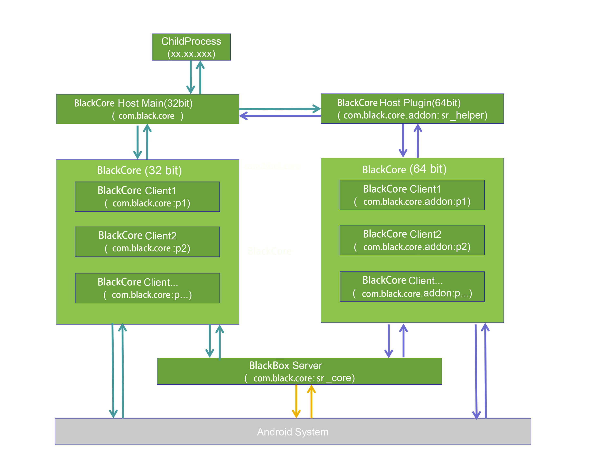
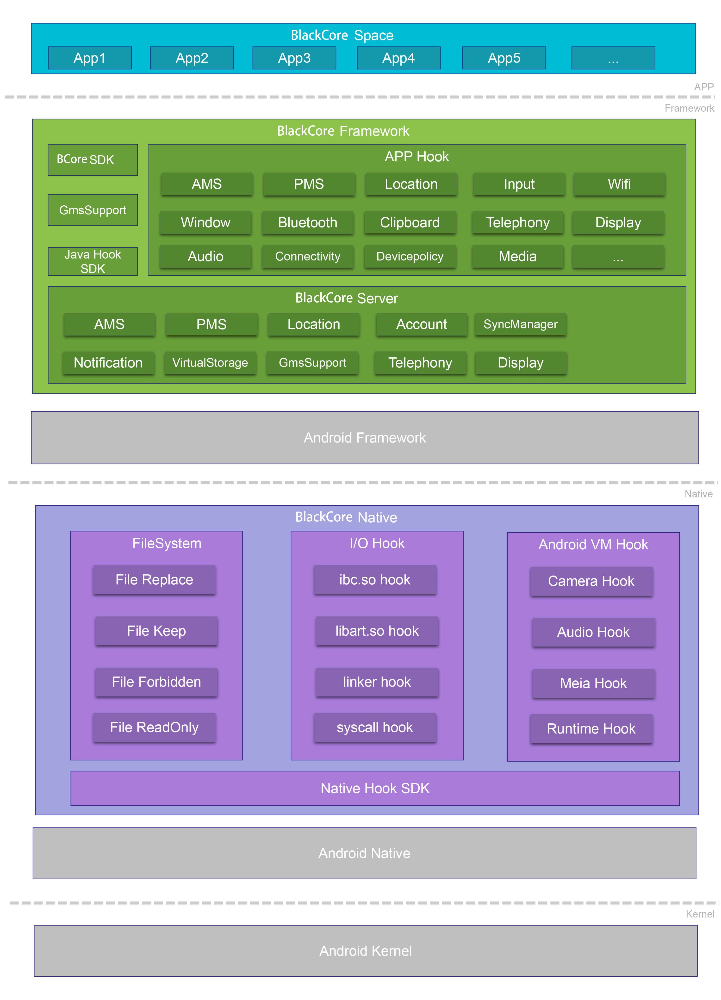

## 插件化进程模型

如下图示，`PluginCore`进程模型包括`Plugin Space`、`Plugin Framework`、和`Plugin Native`等层级，以实现系统隔离和请求修改等功能。

## 插件化框架架构

| 框架层级         | 主要工作                                                     |
| :--------------- | :----------------------------------------------------------- |
| Plugin Space     | 由`PluginCore`提供了一个内部的空间，用于安装要在其内部运行的APP，这个空间是系统隔离的。 |
| Plugin Framework | 这一层主要给`Android Framework`和`PluginCore`做代理，这也是`PluginCore`的核心。`PluginCore`提供了一套自己的`PluginCore Framework`，处于`Android Framework`与`PluginCore APP`之间。对于`PluginCore`，其访问的所有系统`Service`均已被 `PluginCore Framework` 代理，它会修改`PluginCore`的请求参数，将其中与`PluginCore`安装信息相关的全部参数修改为宿主的参数之后发送给`Android Framework`（有部分请求会发送给自己的`PluginCore Server`直接处理而不再发送给`Android`系统）。这样`Android Framework`收到`PluginCore`请求后检查参数就会认为没有问题。待`Android`系统对该请求处理完成返回结果时，`PluginCore Framework`同样也会拦截住该返回结果，此时再将原来修改过的参数全部还原为`PluginCore`请求时发送的。这样`PluginCore`与`Android`系统的交互也就能跑通了。 |
| Plugin Native    | 在这一层主要为了完成2个工作，IO重定向和`PluginCore APP`与`Android`系统交互的请求修改。IO重定向是因为可能有部分APP会通过写死的绝对路径访问，但是如果APP没有安装到系统，这个路径是不存在的，通过IO重定向，则将其转向`PluginCore`内部安装的路径。另外有部分jni函数在`PluginCore Framework`中无法`hook`的，所以需要在`native`层来做`hook`。 |

