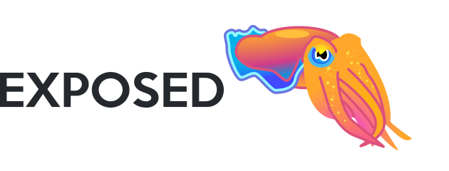
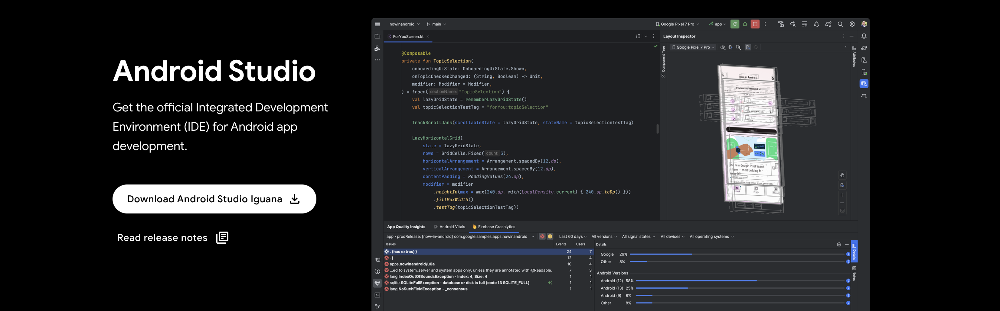

 
 

> `Glass Application SDK` 是一套基于 `Android`原生的XR眼镜应用开发工具包，内部包含Glass常用UI组件和Glass应用基类，旨在帮助开发者以极简的接入步骤，快速构建适配多个厂商、数十款XR设备的  `XR Glass`应用。

:::info

现阶段`Glass SDK`基于`MVVM`架构和`Material3`，SDK封装采用`Options API`思想，使用`DataBinding`框架完成UI和数据的双向绑定。当然，组合优于继承，后续也会推出基于`Composition API`设计思想的组合式API，届时将不限制应用架构为`MVVM`。

:::

## 开放背景

`Glass Application SDK`
的开放背景源于目前割裂脆弱的XR应用生态，我们团队从2020开始就开始打造XR硬件应用方面的生态，业内首发的SOP和远程协助使得我们在XR硬件适配方面拥有丰富的经验，至今已经适配包括`Rokid`、`Vuzix`、`Argooz`、`小米蜂巢世纪`、`拜特尔`、`谷东科技`、`Realware`、`Moziware`
等多个厂商在内的近二十几款XR眼镜。2024年伊始，基于战略考量，同时也想将这部分适配经验转化成SDK固定下来，我们决策了`Glass Application SDK`
的开放计划，普惠行业的同时，期望与广大XR应用开发者一起构建繁荣的XR应用生态。

::: info

- **系统版本割裂：**  目前不同厂商的XR眼镜安卓系统版本各不相同，分布于安卓7.0-安卓12之间，在智能手机上本就脆弱割裂的安卓系统在XR眼镜上现状更加雪上加霜，而且同一厂商不同款设备ROM都大相径庭。

- **人机交互方式大不相同：**
  得益于我们团队在XR眼镜行业的累积经验，我们接触并适配了大量的发布或未发布的XR眼镜。目前主流的XR眼镜交互可能包含旋钮、触摸板、语音指令、外插智能手机等多种交互方式当中的一种或多种，人机交互方式割裂，同时该SDK也是我们想积累下来的统一交互方面的技术经验。

:::

## 语言要求

`Glass Application SDK` 完全采用Kotlin
Lang构建，借助Kotlin强大的Lambda语法和扩展函数，你可以快速的构建基础的Glass应用，实现Glass操作焦点的交互逻辑。当然本文档也提供Java版本的示例代码，但不推荐使用。

 

## 开发环境

> [Android Studio](https://developer.android.com/studio) 是一个在各个方面都最大程度地提高安卓应用开发人员的生产力的IDE，由Jetbrains和Google提供，适用于 JVM 平台语言编写下的安卓应用的开发，也是开发XR Glass应用推荐使用的IDE。

