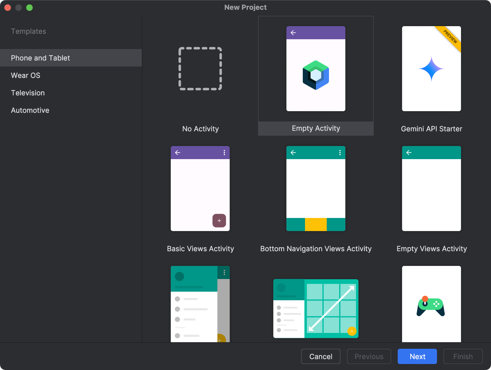

## 创建项目

1. (可选) 创建新项目。详见 [Create a project](https://developer.android.com/studio/projects/create-project)。

   a. 打开 `Android Studio`，选择 `New Project`。
   
   <p align="center"></p>

   b. 选择 **Phone and Tablet > Empty Views Activity**，点击 **Next**。

   <p align="center"></p>
   
   c. 设置项目名称和存储路径，选择语言为**Java/Kotlin**，点击 **Finish** 创建 Android 项目。
   
   ::: info
   
   创建项目后，**Android Studio** 会自动开始同步 gradle，稍等片刻至同步成功后再进行下一步操作。
   
   :::
   
      

## 集成依赖

1. 打开项目根目录下的 `settings.gradle` 文件，添加 Maven Central 依赖 (如果已有可忽略)：

   ```gradle
   maven { url("http://maven.teamhelper.cn:8081/repository/MST/") }
   ```

   ::: warning

   如果你的 Android 项目设置了 [dependencyResolutionManagement](https://docs.gradle.org/current/userguide/declaring_repositories.html#sub:centralized-repository-declaration)，添加 Maven Central 依赖的方式可能存在差异。
   :::

2. 打开 `/app/build.gradle` 文件，在 `dependencies` 中添加Glass SDK 的依赖。你可以从[版本路线](https://doc.shengwang.cn/doc/rtc/android/overview/release-notes)中查询 SDK 的最新版本，并将 `<LatestVersion> `替换为具体的版本号。
    :::: code-group
    ::: code-group-item Gradle Groovy DSL

    ```gradle
    dependencies {
        implementation 'com.teamhelper.xr:glass-sdk:<LatestVersion>'
        ...
    }
    ```

    :::
    ::: code-group-item Gradle Kotlin DSL

    ```kotlin
    dependencies {
        implementation("com.teamhelper.xr:glass-sdk:<LatestVersion>")
        ...
    }
    ```

    :::
    ::::

## 配置Java版本

在你的项目 `build.gradle.kts` 或 `build.gradle` 中修改 Kotlin 的 Java 版本为 17 及以上。

:::: code-group
::: code-group-item Gradle Groovy DSL

```gradle
android {
    compileOptions {
        sourceCompatibility JavaVersion.VERSION_17
        targetCompatibility JavaVersion.VERSION_17
    }
    kotlinOptions {
        jvmTarget = '17'
    }
}
```

:::
::: code-group-item Gradle Kotlin DSL

```kotlin
android {
    compileOptions {
        sourceCompatibility = JavaVersion.VERSION_17
        targetCompatibility = JavaVersion.VERSION_17
    }
    kotlinOptions {
        jvmTarget = "17"
    }
}
```

:::
::::

## 开始使用

1. 创建自定义`Application`类继承自`GlassBaseApplication`，并在`AndroidManifest.xml`中注册你自定义的`Application`类。

   :::: code-group
   ::: code-group-item App.kt

   ```kotlin
   import com.mst.basics.GlassBaseApplication
   
   class App : GlassBaseApplication()
   ```

   :::
   ::: code-group-item App.java

   ```java
   import com.mst.basics.GlassBaseApplication;
   
   public class App extends GlassBaseApplication { }
   ```

   :::
   ::::

   :::: code-group
   ::: code-group-item AndroidManifest.xml

   ```xml
   <?xml version="1.0" encoding="utf-8"?>
   <manifest xmlns:android="http://schemas.android.com/apk/res/android">
   
       <application
           android:name="<your_package>.App"
   				...
   				>
           ...
       </application>
   
   </manifest>
   ```

   :::
   ::::
