## 支持性列表

以下是目前框架支持的XR Glass眼镜列表：

> 注：✅表示目前框架支持，🟡表示灰度支持但现未对外暴露，❌表示目前不支持。

|    厂商     |  别名  |      设备型号       | ST |       Description       |
|:---------:|:----:|:---------------:|:--:|:-----------------------:|
|  ARGOOZ   | 闪亮视觉 |  `ARGOOZ R700`  | ✅  | 目前厂商只为特定包名白名单提供屏蔽系统语音角标 |
| SUPERHEXA | 蜂巢世纪 |  `VISION-SV1G`  | ✅  |          完全适配           |
|   VUZIX   | `-`  |     `M400`      | ✅  |          完全适配           |
|   VUZIX   | `-`  |     `M4000`     | ✅  |          完全适配           |
|   ROKID   | `-`  |    `Glass2`     | ✅  |          完全适配           |
|   ROKID   | `-`  |    `Xcraft`     | ✅  |          完全适配           |
|  GOOTTON  | 谷东科技 |    `C2000s`     | ✅  |          完全适配           |
|   EPSON   | 爱普生  |    `BT-45CS`    | ✅  |          完全适配           |
|    BTR    | 拜特尔  |    `FHY3.7`     | ✅  |          完全适配           |
|   钜星科技    | `-`  |  `JUXING X21`   | ❌  |          暂不支持           |
| Moziware  | 瑞欧威尔 |     `CIMO`      | ✅  |          完全适配           |
| Moziware  | 瑞欧威尔 | `Navigator 500` | ✅  |          完全适配           |
| Moziware  | 瑞欧威尔 |     `HMT-1`     | ✅  |          完全适配           |
|  Chinvis  |  谦视  |   `M1 Pro单目`    | ✅  |          完全适配           |
|  Chinvis  |  谦视  |   `M1 Pro双目`    | ✅  |          完全适配           |
|  Lenovo   |  联想  |  `New G2 Pro`   | ❌  |          暂不支持           |
|   Qidi    | 奇点临近 |   `QIDI ONE`    | 🟡 |  目前不支持动态语音指令，目前尚未合入主分支  |
| LLVISION  | 亮亮视野 |   `G26B0-NL`    | 🟡 |    外插手机形式，目前尚未合入主分支     |
| Microsoft |  微软  |   `Hololens2`   | ❌  |          暂不支持           |

## **AR设备白皮书**

[AR产业应用白皮书-魔数团信息科技.pdf](/AR产业应用白皮书-魔数团信息科技.pdf)

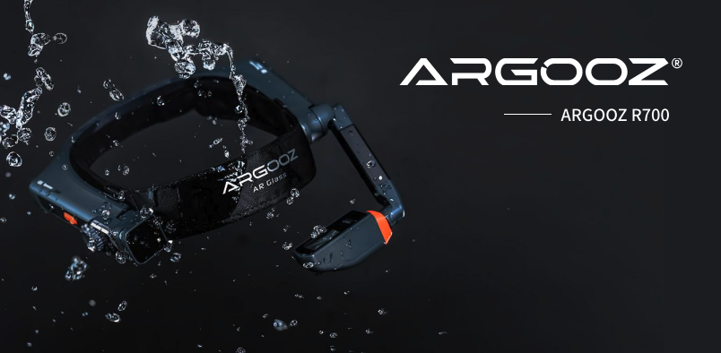

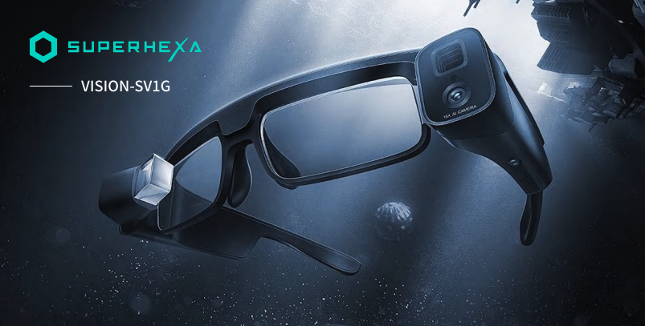

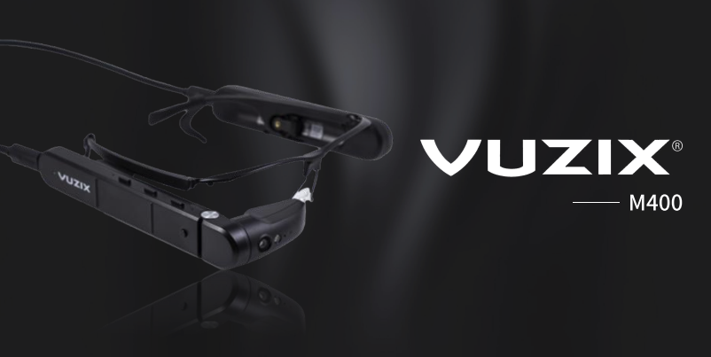

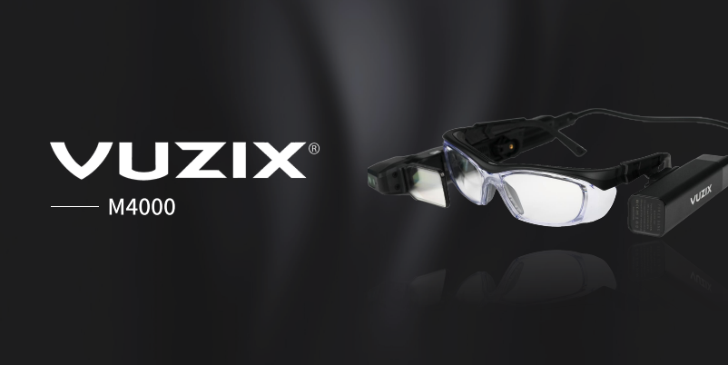

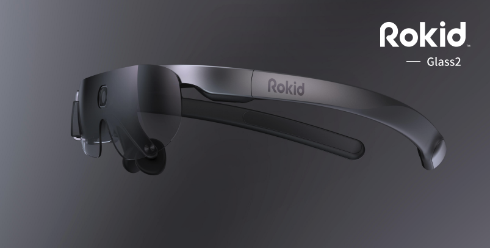

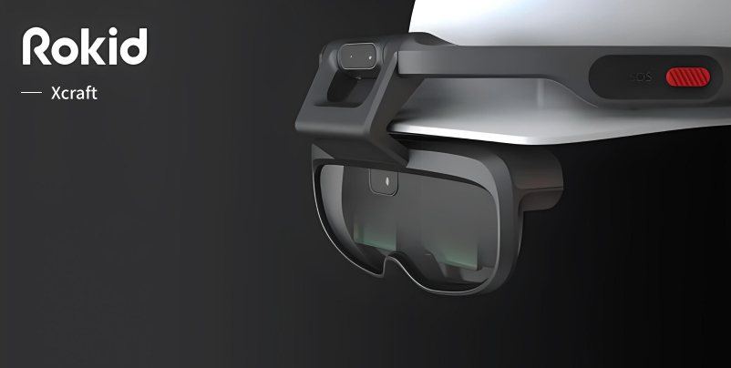

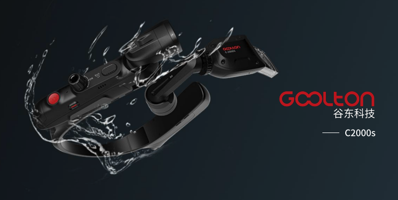

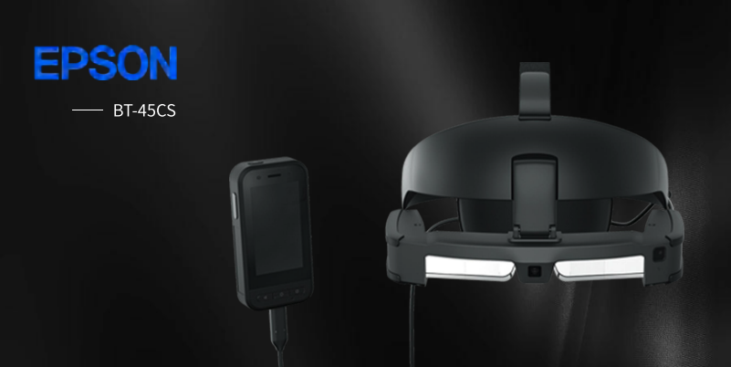

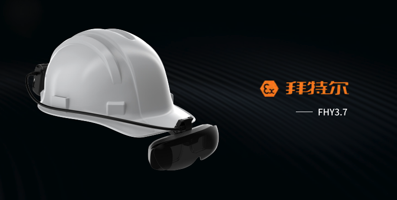

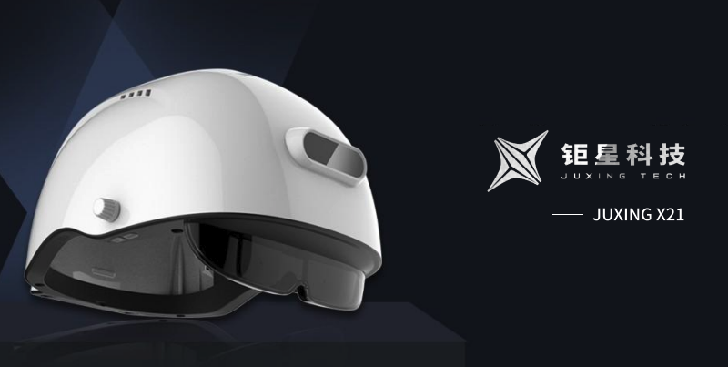

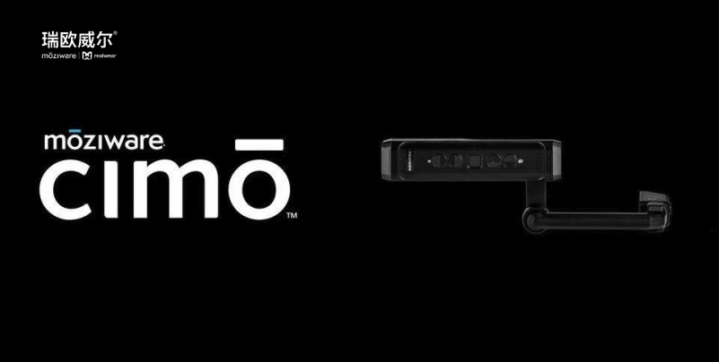

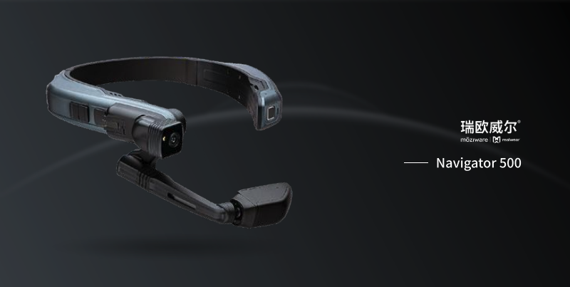

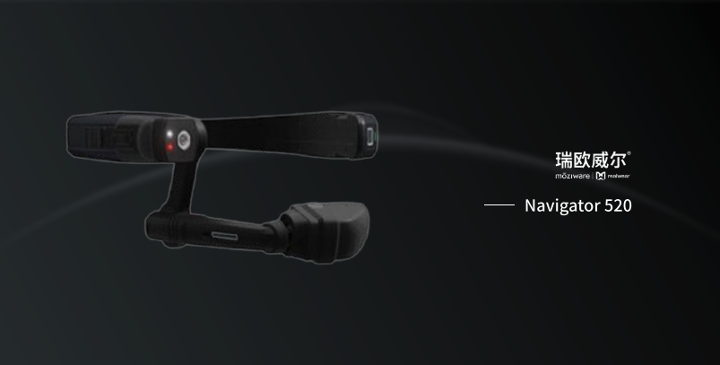

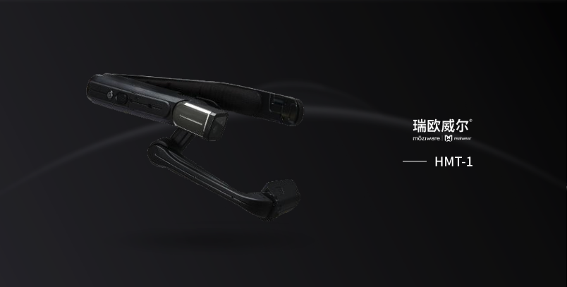

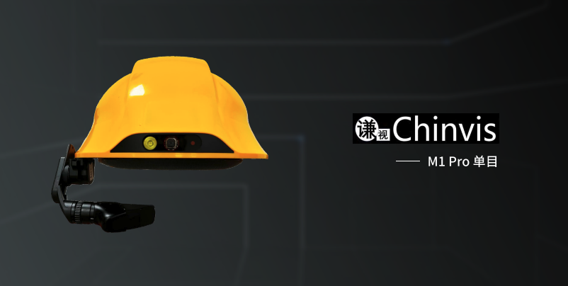

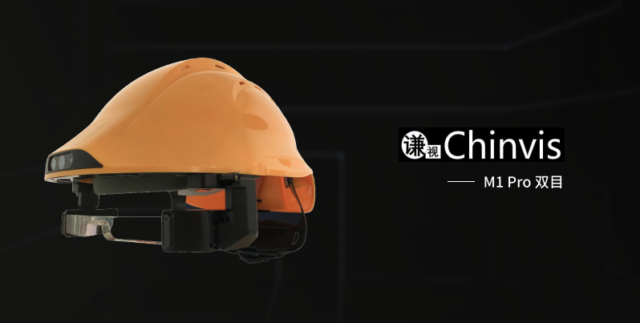

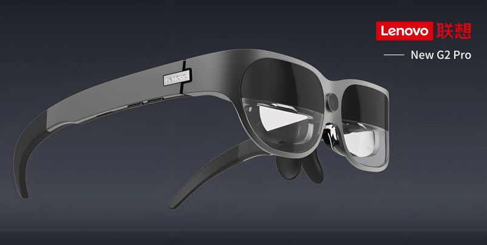

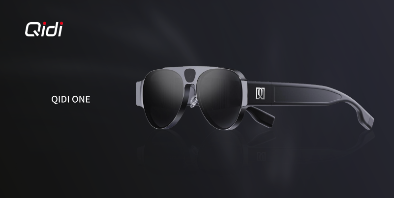

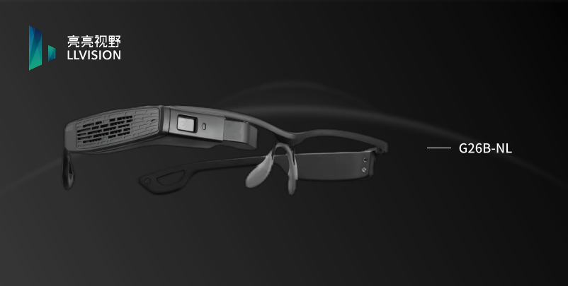

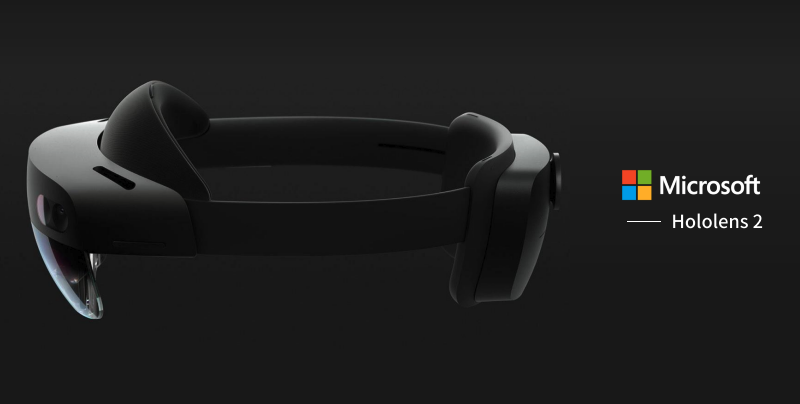