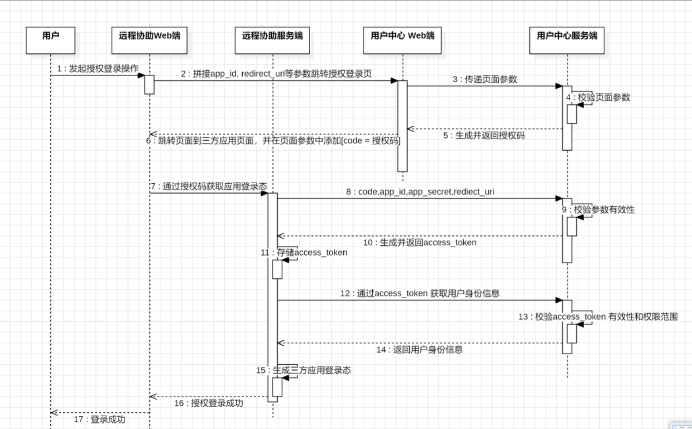

### 三方应用登录

移动应用登录是基于 [OAuth 2.0](https://oauth.net/2/) 标准协议实现的，通过ucenter账号授权登录第三方应用的能力。

**准备工作**

在魔数团开放平台开发者后台创建一个应用，并获得应用的AppId和AppSecret

**接入流程图**

第一步：[获取登录授权码code]

第二步：[获取access_token]

第三步：[获取用户身份信息]

第四步：[刷新已过期的access_token]

### 快捷登录

**概述**

​	为了实现在网页内部完成授权登录的流程，避免跳转到登录页，保证流畅的体验，ucenter登录之后，可以立即实现三方应用的登录态转换。

授权码的有效期是 5 分钟，且只能被使用一次。

第一步：uenter获取授权码，传入code

第二步：[获取access_token]

第三步：[获取用户身份信息]

第四步：[刷新已过期的access_token]