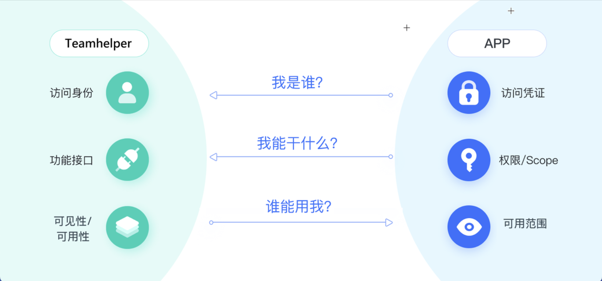
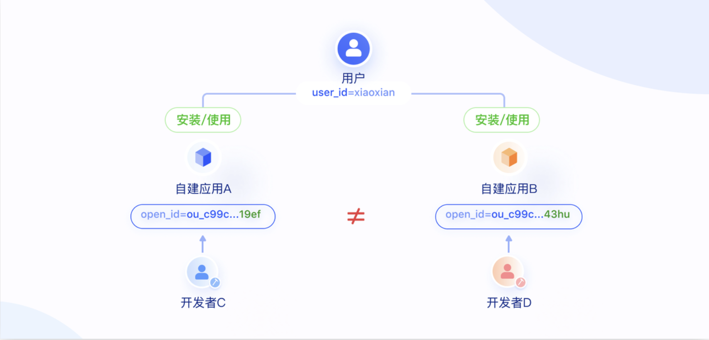
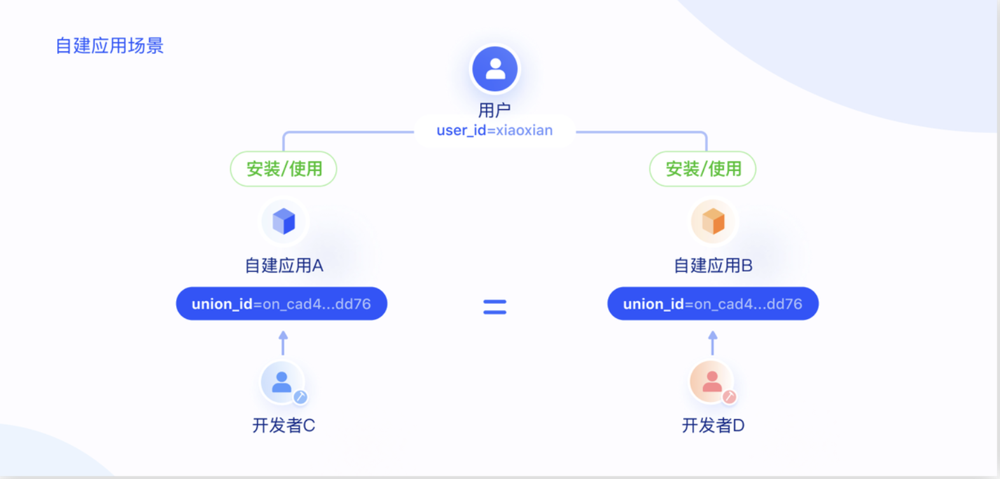

### 应用鉴权

​	权限体系是Teamhelper保护企业数据资产的核心机制，也是开发者在接入Teamhelper生态时要关注的关键问题，本文帮助你快速了解Teamhelper的权限体系。

应用权限体系分为以下三个维度，这些维度的结合，使得Teamhelper的权限管理更加灵活，安全性更高。

- **访问凭证（access_token）**：用于识别应用在访问Teamhelper时使用的虚拟身份，代表应用从平台侧获取的授权。用于验证调用方身份、确保调用方具有执行操作所需要的权限。详情参考 应用访问凭证。
- **API** **权限（Scope）**：定义应用能够调用哪些Teamhelper开放能力接口（OpenAPI）。API 接口权限是以应用为维度授予的，每个应用的接口权限都是独立存在的，若多个应用需要调用同一个接口，那么每个应用都要添加对应的接口权限。详情参考 应用 API 权限。
- **可用范围**：定义哪些用户可以在Teamhelper中看到和使用该应用，详情参考 应用可用范围。

### 用户身份体系

#### **用户身份概述**

​	在自建应用的场景中也是类似，区别在于**自建应用只可在应用开发者所在的租户内使用**， Open ID 在不同的自建应用中不同，但是 Union ID 则相同。

	

​	Open ID 和 Union ID 都是基于应用层面的概念。如果用户处于两个不同的租户下，即 **User ID 不相同的话， Open ID 和 Union ID 也都是隔离的**。

例如: 上例中的用户小娴除了是「**南京魔数团**」的成员，同时还是租户「**杭州魔数团**」的成员，并且这两个租户都安装了**远程协助**这个应用，小娴在这两个团队内的**远程协助**应用中的`union_id`也是不相同的。

#### 用户身份体系

**user_id：**用户在企业内的身份。 同一个用户在租户 A 和租户 B 内的 user_id 是不同的。

**open_id：**用户在应用内的身份。 同一个 user_id 在不同应用中的 open_id 不同，其值统一以 ou_ 为前缀，如`ou_c99c5f35d542efc7ee492afe11af19ef`。

**union_id：**用户在同一应用服务商提供的多个应用间的统一身份。让应用开发商可以把同个用户(以 user_id 为标识）在多个应用中的身份关联起来。在需要跨应用做用户 ID 关联的场景中，开发者可以使用开放平台提供的 union_id。union_id 以 on_ 为前缀，如 `on_cad4860e7af114fb4ff6c5d496d1dd76` 。