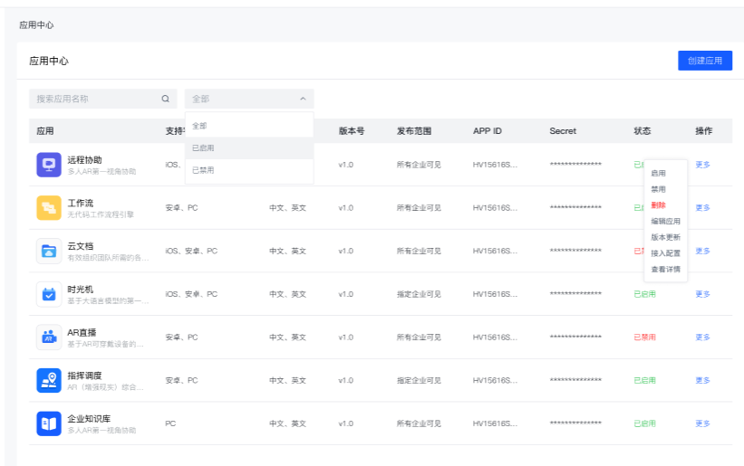
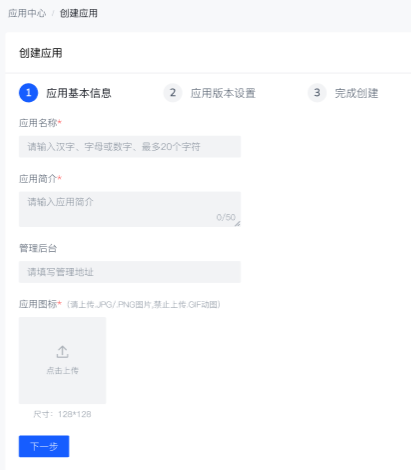
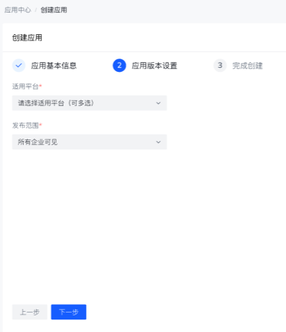
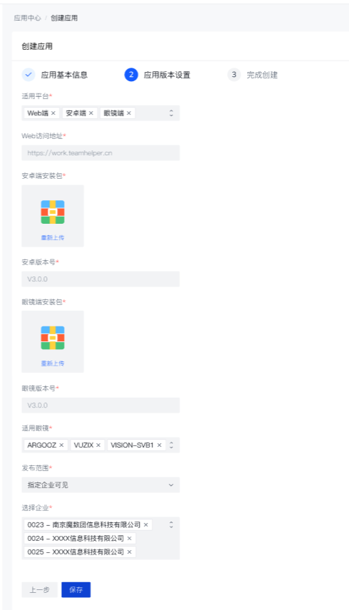
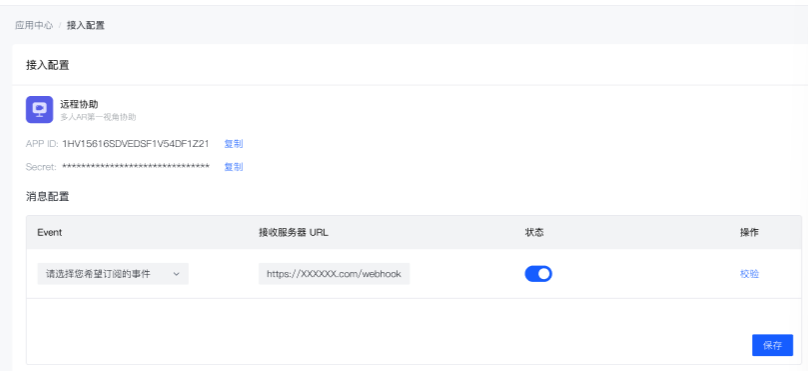
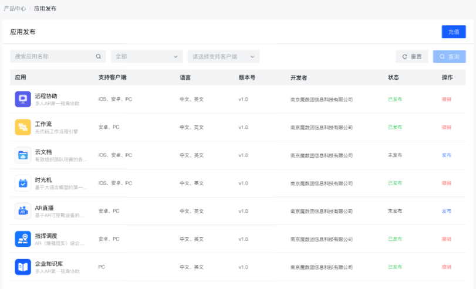
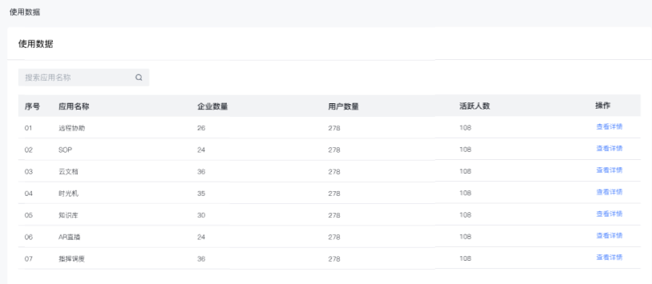
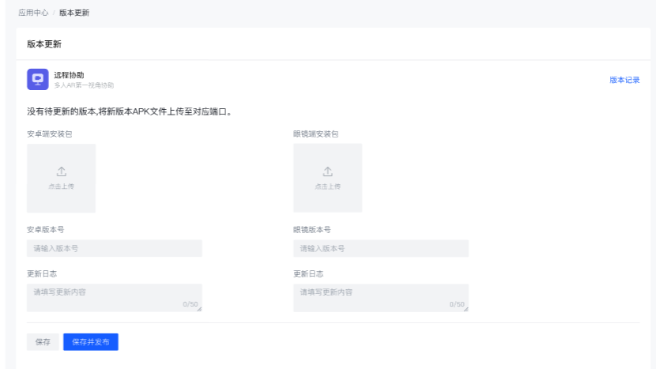

步骤一：成为魔数团的开发者用户

​	在魔数团开放平台上开发应用前，你必须先成为魔数团的开发者用户。目前的开发者用户是系统初始化进去的，只要将开发者用户的信息，发送给魔数团平台管理员，管理员就可以从后台将开发者信息初始进系统了，初始化后，开发者用户就可以登录魔数团的运营平台，进行创建应用了；

步骤二：创建应用

- 在运营管理平台，打开应用中心页面

  

- 点击创建应用，输入应用基本信息，如应用名称、应用简介、管理后台地址、应有图标，选择是否为自有应用，然后点击下一步

  

- 选择应用适用的平台，以及发布范围，这里可以选择特定的企业，也可以选择所有企业，然后点击下一步

  

- 选择适用的眼镜列表，安装包，版本号等信息，点击保存，即可完成应用创建。

  

步骤三：配置应用且订阅事件

在运营管理平台，打开应用中心页面，选择某一条应用记录，选择操作中的接入配置，即可进入应用配置页面；

在接入配置中，输入三方应用的回调地址，以及需要订阅的事件等。

APPID: 用于标识某个应用，唯一值，可复制；

Secret: 公钥，系统加密方式采用RSA非对称加密方式，关键信息发起方可用公钥加密，接收方用私钥解密，拿到明文数据用于业务处理；

接收服务器URL：即回调URL，运营平台通过此地址跟应用做数据交互；

Event: 事件类型，目前事件类型只定义四个：

​	1001：应用用户变更类事件，

​	1002：token更新类事件，

​	1003：检查回调地址连通性事件，

​	1004：目前为预留事件;

​	1005：管理员配置应用权限;

校验：此校验只验证回调URL是否可以正常连通。

 步骤四：测试应用

​	平台默认提供一个测试的账户，使用期限一般为7天，用于验证应用和平台之间的交互是否正常，测试完后才可以启用应用；

步骤五：启用应用

​	当前一个步聚测试完成后，点击启用，当应用为启用状态时，运营管理员才可以将此应用进行发布。

步骤六：发布应用

​	当某个应用为启用状态时，平台的运营管理员，就可以将此应用进行发布，发布后就可以被代理商维护成一个产品包，对外进行销售了。

步骤七：运营与运维

​	开发者可以在平台中查看，所创建应用的使用数据，包括用户数、活跃用户数等，如下图所示：

​	针对各个应用，可以根据情况进行版本的迭代和更新，新增功能或者排除一些使用中异常，然后再重新发布使用，如下图所示：

