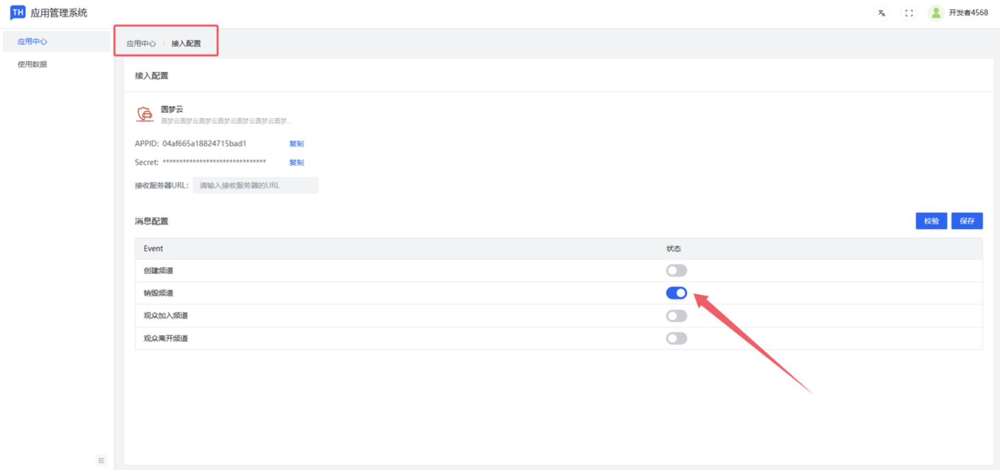

​	通过事件订阅，应用可以及时响应中的变更事件。当事件发生时，开放平台会按照你配置的订阅方式发送事件消息。

**适用场景**

下面列举两个简单的适用场景。开发者可以根据实际需求，订阅不同的事件。

**实时数据处理**

如果应用对数据的实时性要求比较高，希望能够及时地从同步数据的变化，可以进行事件订阅。例如在用户离职时，应用需要第一时间处理离职用户的业务数据，就可以订阅员工离职事件。

**快速事件响应**

如果应用需要及时响应用户的操作，可以进行事件订阅。例如当新人入群时，群机器人需要给新人发送一条欢迎消息，就可以订阅用户进群事件。

**订阅流程**

1. 接入配置
2. 开启事件状态
3. 接受并处理事件

**事件推送**

**推送周期和频次**

订阅的事件发生时，开放平台将会通过 HTTP POST 请求发送 JSON 格式的事件数据到预先配置的推送地址

应用接收到包含事件数据的请求（向开发者服务器发送的 HTTP POST 请求）时，需要在 3 秒内以 HTTP 200 状态码响应该请求。否则开放平台认为本次推送失败，并以 1分钟、5分钟、30分钟、6小时的间隔重新推送事件，最多重试 5 次。

**事件推送顺序**

为了保证用户的事件可用性以及内外部数据变化一致性，对于部分事件，开放平台使用了有序事件的形式进行推送。即在用户对前一事件接收成功后，才会推送下一事件。

对于有序事件，用户需要保证相应前后事件的正常消费，避免造成事件的阻塞或收到事件不及时。即当有序事件发生阻塞时，后续投递的事件会直接进入重试队列排队，等前一事件成功后才会开始重试投递队首的排队事件，开始第一次重试。